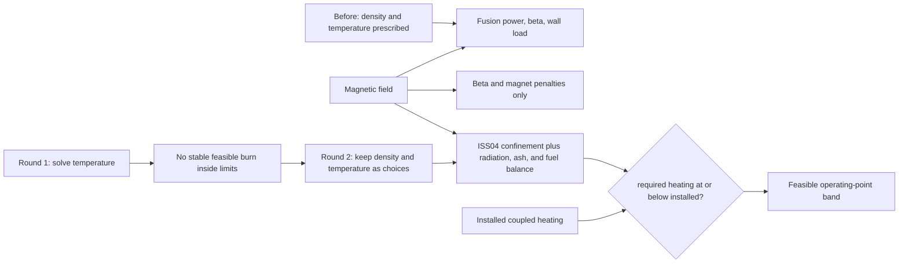

# Narrative: operating-point-closure

This is the human-facing engineering story of the goal. It summarizes cited records; it is not evidence, state, or a decision record. If this account and a cited source disagree, the source wins.

- **Goal status:** Closed 2026-09-02 after two rounds.
- **Narrative cutoff:** Clean sources at base commit `19b79f929df632af78992711e1b5a6bc5989f011`; owner close recorded in [goal.md](../orchestration/goals/operating-point-closure/goal.md) and [trail.md](../orchestration/goals/operating-point-closure/trail.md).
- **Review status:** The round results, six learnings, and Row-1 re-grade were independently reviewed.

## At a glance

- **Starting model:** Density and temperature were inputs. The model used them to calculate fusion power, wall loading, and plasma beta, which is plasma pressure divided by magnetic pressure. It did not calculate whether the machine could sustain that plasma.
- **Why that mattered:** Higher magnetic field increased magnet cost and made the beta constraint harder to satisfy. It gave no credit for better plasma confinement, so the optimizer preferred the lowest field that still passed the beta check.
- **Round 1:** The team tried to solve plasma temperature from steady-state power balance. The calculation showed that the reference design does not have a stable, feasible burn point inside the modeled limits, so this was not a workable model architecture.
- **Round 2:** Density and temperature remained design choices. The model now uses ISS04, an empirical stellarator energy-confinement scaling, to calculate the heating power needed to sustain each choice. It rejects points that need more plasma-coupled heating than the plant has installed.
- **Measured outcome:** No point in the 154-point field-density grid was feasible with 50 MW delivered to the plasma. At 110 MW, a narrow feasible region appeared between the minimum field needed for confinement and the maximum field allowed by the conductor.
- **Grade outcome:** The frozen Row-1 physics score moved from 2 to its target of 3. The reviewed basis is in [the goal close](../orchestration/goals/operating-point-closure/trail.md#goal-close--2026-09-02) and [the fresh re-grade](../../.project/active/demo-depth-rubric/grading-r1-regrade.md).

## Starting point and motivation

### What the model could already do

The plasma model already calculated fusion power, beta, neutron wall loading, and peak magnetic field from machine geometry and prescribed plasma profiles. This was enough to compare the consequences of different assumed plasma states.

That capability earned Row 1 a physics score of 2. The initial grade and the target are recorded in [grading.md](../../.project/active/demo-depth-rubric/grading.md) and the frozen [rubric.md](../../.project/active/demo-depth-rubric/rubric.md).

### What the model could not do

The model did not contain a confinement or transport relation. It therefore could not answer a basic question: can this magnetic field and heating system actually maintain the chosen density and temperature?

No power limit pushed back on an unsupported plasma choice. A user could prescribe a demanding state, and the downstream fusion calculation would accept it without calculating the auxiliary heating needed to hold it there.

The defect was visible in the earlier magnet study. Increasing magnetic field raised magnet cost and made the beta limit harder to satisfy, but the model gave no credit for the improved confinement that higher field should provide. The optimizer therefore selected the lowest field that still passed the beta check. That behavior is recorded in [the magnet-technology synthesis](../../exploration/stellarator_e2e/studies/20260823-magnet-technology-ab/synthesis.md).

The goal was to connect field, confinement, plasma state, and heating in an executable calculation. A valid operating point needed both a benefit from field and a clear reason to reject a plasma state that the installed heating could not sustain.

## Story in one picture

The diagram is a reading aid. The implemented chain and its exact equations are in [the WI-037 design](../completed/20260902_WI-037_operating-point-closure/design.md) and [the model declaration](../../models/library/analyses/mfe_plasma_sustainment.sysml).

## Research learnings

This goal did not begin with a new literature search. It checked the equations already available in the admissible Stellaris source against page images, then exercised them in a small prototype before changing the production model. Three findings survived the fresh round-1 review and are recorded in [learnings.md](../orchestration/goals/operating-point-closure/learnings.md).

### The source equations reproduced the reference calculation

ISS04 confinement, radiation, helium-ash balance, and fuel balance reproduced the published reference point to within 4% without fitting an adjustment factor. That agreement was strong enough to use the equation chain as the model basis.

The remaining difference came mainly from the model's analytic stored-energy expression. The check also caught an important input definition: ISS04 uses line-averaged density, not volume-averaged density. See [L-001](../orchestration/goals/operating-point-closure/learnings.md#l-001--the-stellaris-appendix-closure-is-admissible-and-reproduces-the-printed-point-a-to-4-with-nothing-fitted) and [the prototype notes](../orchestration/goals/operating-point-closure/evidence/T-002_prototype/NOTES.md).

### Solving temperature would hide the real problem

The first architecture treated temperature as an output of steady-state power balance. The prototype found no stable, feasible burn solution inside the model's own limits.

At the Stellaris reference point, the plasma is about 90 MW short of self-sustaining. It also lies on an unstable branch of the power-balance curve, where a small error in net power produces roughly three times that relative error in the solved temperature.

A temperature solver would therefore fail, jump to an unwanted branch, or conceal the shortfall behind numerical behavior. The round closed as a useful negative result rather than forcing an unreliable solver into the model. See [L-002](../orchestration/goals/operating-point-closure/learnings.md#l-002--a-solved-t-operating-point-is-the-wrong-architecture-at-this-model-state-forward-sustainment-is-the-workable-form) and [the round-1 review](../orchestration/goals/operating-point-closure/evidence/round1_review.md).

### Giving field its confinement benefit exposed the next constraints

Once magnetic field improved confinement in the calculation, the optimizer had a physical reason to increase field. It then ran into the conductor's peak-field limit and the winding pack's stress limit.

That is the intended behavior: a design lever should carry both its benefit and its penalties until another real constraint stops it. See [L-003](../orchestration/goals/operating-point-closure/learnings.md#l-003--with-confinement-in-the-chain-field-is-rewarded-and-immediately-collides-with-the-conductor-ceiling-and-the-stress-fence).

## Model changes

WI-037 changed the central question from “what follows from this prescribed plasma?” to “can this machine sustain this prescribed plasma?” The requirements, architecture, and implementation record are in the archived [spec](../completed/20260902_WI-037_operating-point-closure/spec.md), [design](../completed/20260902_WI-037_operating-point-closure/design.md), and [plan](../completed/20260902_WI-037_operating-point-closure/plan.md).

The new calculation proceeds in four steps:

1. It converts the chosen peak density into the line-averaged density required by ISS04 and calculates energy-confinement time from machine size, magnetic field, density, and heating.
2. It calculates radiation losses, thermal stored energy, alpha-particle heating from fusion reactions, and the external heating needed for steady operation.
3. It solves helium ash with a guarded fixed-point calculation. It then derives the deuterium-tritium fuel density from charge balance and derives electron temperature from the stated ion-to-electron temperature ratio.
4. It compares required external heating with the heating power actually delivered to the plasma. The point passes `sustainment_ok` only when the installed system can supply at least that much power.

Peak electron density and ion temperature remain design choices. Deuterium, tritium, helium ash, and electron temperature are no longer unrelated values typed into the plant model.

Fusion power and beta now use those internally consistent fuel, ash, and temperature quantities. This changed some study inputs, so the work item also records which older studies cannot be replayed with their previous input keys.

The integration checks then confirmed that the generated analysis package came from this exact model state. All ten checks passed for package version `35e922c5…`; the machine-readable return is [T-004_integration_return.json](../orchestration/goals/operating-point-closure/evidence/T-004_integration_return.json).

## Study results

The committed [sustainment study](../../exploration/stellarator_e2e/studies/20260901-sustainment-fence/record.md) asked two questions. Does higher field now receive credit for better confinement? If so, which constraints bound the feasible operating region? A fresh reviewer independently recounted the results in [synthesis.md](../../exploration/stellarator_e2e/studies/20260901-sustainment-fence/synthesis.md).

### At 50 MW, the machine had no feasible point

The study evaluated 154 combinations of magnetic field and density with 50 MW delivered to the plasma. None passed every constraint.

At lower field, confinement was too weak and the required heating exceeded 50 MW. Increasing field eventually solved that problem, but those points exceeded the conductor's peak-field limit. The model had exposed a specific conflict between plasma sustainment and conductor capability.

### At 110 MW, a narrow feasible region appeared

With 110 MW delivered to the plasma, nine evaluated points passed every modeled constraint. The lowest-cost point in the explored window was:

| Quantity | Value |
|---|---:|
| Levelized cost of electricity | 293.468 $/MWh |
| Coil current | 15 MA |
| Ion temperature | 14.63 keV |
| Density | 1.1 times the reference value |
| Plasma beta | 0.0311 against a 0.05 limit |

This is the best point in the tested window, not proof of a global machine optimum. The feasible current range was bounded by insufficient confinement at the low end and excessive conductor field at the high end.

The beta value is also informative. Before this goal, the optimizer increased field only until beta barely passed. After the change, it chose substantially more field because the confinement benefit was worth part of the added magnet burden.

### The result exposed the next modeling gap

Once a point had enough installed heating to pass sustainment, extra heating capacity added cost but no new physical or economic benefit. The system had a meaningful feasibility role, but it was still represented as one installed-power number.

That behavior identified the next Row-4 gap: split heating into the electricity drawn by the plant, the source power produced by the hardware, and the power that actually reaches the plasma.

The point data are in [results/points.csv](../../exploration/stellarator_e2e/studies/20260901-sustainment-fence/results/points.csv). The study also exported operands through an independent calculation used to check generated model outputs; those values are in [results/oracle_operands.csv](../../exploration/stellarator_e2e/studies/20260901-sustainment-fence/results/oracle_operands.csv).

That second file does not independently verify every internal sustainment quantity. The verified results are the pass/fail constraint verdicts and the model channels that the independent calculation could reproduce.

## Outcome and follow-on issues

The fresh grader scored Row 1 physics at 3 against the same frozen rubric that had scored it 2. The model now links field and heating to the plasma state and rejects choices the plant cannot sustain.

The owner accepted the supporting evidence, closed WI-037, and closed the goal. Those rulings are recorded in [the goal close](../orchestration/goals/operating-point-closure/trail.md#goal-close--2026-09-02).

The result also identified two ways to escape the 50 MW conflict:

- Improve the conductor model so a higher allowable field carries defensible material, stress, and cost consequences. This became WI-038.
- Replace the single heating-power input with a real wall-plug-to-plasma system model. This became WI-039.

Those were follow-on questions, not missing work needed to close this goal.

Several limits remain explicit:

- The Sudo density-limit equation was not available through an admissible source, so the goal did not add that constraint.
- The fixed confinement-quality factors have not yet been varied in a sensitivity study.
- Several internal sustainment quantities were exported only by the independent checking calculation, not directly from the generated model.
- The study record needed an addendum to correct prose errors that did not change the numerical result.

These limits are recorded in [the round-2 review](../orchestration/goals/operating-point-closure/evidence/round2_review.md) and the fresh grader's evidence-integrity notes in [grading-r1-regrade.md](../../.project/active/demo-depth-rubric/grading-r1-regrade.md).

## Evidence and visual index

| Visual | What it can honestly show | Source |
|---|---|---|
| Before-and-after causal graph | The shift from prescribed plasma quantities to a confinement-linked sustainment constraint | [WI-037 design](../completed/20260902_WI-037_operating-point-closure/design.md), [plasma-sustainment model](../../models/library/analyses/mfe_plasma_sustainment.sysml) |
| Solved-temperature failure sketch | Why the first strategy closed as a useful negative rather than becoming implementation | [prototype notes](../orchestration/goals/operating-point-closure/evidence/T-002_prototype/NOTES.md), [round-1 review](../orchestration/goals/operating-point-closure/evidence/round1_review.md) |
| Field-density constraint map at 50 and 110 MW | Empty space at 50 MW and the narrow feasible band at 110 MW | [points.csv](../../exploration/stellarator_e2e/studies/20260901-sustainment-fence/results/points.csv), [study synthesis](../../exploration/stellarator_e2e/studies/20260901-sustainment-fence/synthesis.md) |
| Grade card | Frozen-rubric movement from R1.P 2 to 3 | [initial grading](../../.project/active/demo-depth-rubric/grading.md), [fresh re-grade](../../.project/active/demo-depth-rubric/grading-r1-regrade.md) |
| Follow-on decisions | How the measured constraint conflict produced conductor and heating work | [goal close](../orchestration/goals/operating-point-closure/trail.md#goal-close--2026-09-02), [study findings](../../exploration/stellarator_e2e/studies/20260901-sustainment-fence/record.md#15-findings) |
