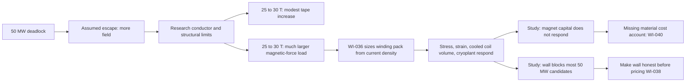

# Narrative: priced-levers

This is the human-facing engineering story of the goal. It summarizes cited records; it is not evidence, state, or a decision record. If this account and a cited source disagree, the source wins.

- **Goal status:** Closed by redirect after one round.
- **Goal closed:** 2026-09-03 at approximately 18:50 PDT (`f937be2c`; Git commit-time proxy). The date and disposition come from [the owner close entry](../orchestration/goals/priced-levers/trail.md#goal-close--2026-09-03).
- **Narrative cutoff:** Clean sources at base commit `19b79f929df632af78992711e1b5a6bc5989f011`; owner close recorded in [goal.md](../orchestration/goals/priced-levers/goal.md) and [trail.md](../orchestration/goals/priced-levers/trail.md).
- **Review status:** The round result and six learnings were independently reviewed. The conductor-grade half was explicitly left open, not declared impossible.

## At a glance

- **Starting question:** The 50 MW sustainment study suggested two ways to recover a feasible machine: tolerate more magnetic field or deliver more heating to the plasma.
- **Why the comparison was premature:** The model treated the maximum conductor field as an adjustable limit and represented heating with one cost line. Neither choice carried enough material, structural, efficiency, or plant-power consequences to support an economic comparison.
- **Research result:** Raising peak field from roughly 25 T to 30 T required only a modest increase in the REBCO superconducting tape on the available scaling, but the electromagnetic load rose sharply. The existing 800 MPa winding-pack stress limit was already optimistic, so simply relaxing it was not credible.
- **Model change:** WI-036 calculated winding-pack size from coil current and current density, meaning current carried per unit area. Pack size then affected structural stress, conductor strain, the coil volume kept at cryogenic temperature, nuclear heat deposited in the coils, and cryoplant size.
- **Study result:** The new geometry and cryogenic loads responded correctly, but magnet capital remained exactly flat. The model had no cost account for most of the winding-pack material being added or removed.
- **Goal outcome:** The study also showed that wall loading blocked most 50 MW candidates. The owner moved heating work into `wall-and-heating`, kept conductor pricing open in WI-038, and created WI-040 to add winding-pack material to the magnet cost model. See [the round-1 review](../orchestration/goals/priced-levers/evidence/round1_review.md) and [the goal amendment](../orchestration/goals/priced-levers/goal.md#amendment-2026-09-03--amends-status-answered-when-amendment-2026-09-02-and-the-wi-036-paths-in-grounding-evidence).

## Starting point and motivation

### The apparent choices

The operating-point goal found no feasible design with 50 MW delivered to the plasma. Lower-field points could not sustain the chosen plasma, while the field needed to improve confinement exceeded the conductor limit.

That left two apparent escape routes. The plant could use a conductor system that tolerated more field, or it could install enough heating to sustain the plasma at lower field.

### Why the model could not price either choice

The maximum conductor field, `B_max`, was typed in rather than calculated. Raising it changed one pass/fail inequality and nothing else. The model did not calculate the extra tape, structural burden, strain, or cost associated with operating at the higher field.

Winding-pack width was also typed in. Making the pack wider reduced calculated stress, but it did not add material, increase cold volume, change the radial build, or affect most magnet capital.

The heating representation was incomplete in a different way. It contained one installed-power value, one typed-in efficiency ratio, and one linear cost line. The goal was to make both levers carry enough physical and economic consequence to compare them honestly. The starting contract is in [goal.md](../orchestration/goals/priced-levers/goal.md).

### The initial hypothesis

The first reconstruction of the predecessor study found 29 points that met the 50 MW sustainment condition. All 29 violated both the peak-field limit and the winding-pack stress limit, which made structural relief look like the first problem to solve.

The goal also recorded an economic warning before changing the model. The apparent high-field escape already cost 13.5% more than the 110 MW heating escape, even before charging it for improved conductor or structure.

A later temperature sweep changed part of that conclusion. That reversal became a central lesson: a constraint study can give the wrong answer when a fixed design variable prevents the optimizer from moving around the constraint. See [the round trail](../orchestration/goals/priced-levers/trail.md) and [L-003](../orchestration/goals/priced-levers/learnings.md).

## Story in one picture

The diagram summarizes the reviewed route. The quantitative research basis is in [T-001_research_return.md](../orchestration/goals/priced-levers/evidence/T-001_research_return.md), the criterion check is in [T-002_criterion_return.md](../orchestration/goals/priced-levers/evidence/T-002_criterion_return.md), and the accepted conclusions are in [learnings.md](../orchestration/goals/priced-levers/learnings.md).

## Research learnings

The goal ran two research cycles before changing the model.

### The structural limit was already optimistic

The registered PPPL basis gave 666 MPa as the ITER-style primary allowable stress. It treated 800 MPa as an optimistic value for improved 316 stainless steel.

A stronger steel substitution offered only about 5% more allowable stress on the available basis. The model could not honestly escape by turning up `sigma_allow`. See [the first research return](../orchestration/goals/priced-levers/evidence/T-001_research_return.md).

### Higher field stressed structure faster than it consumed tape

The source-supported REBCO scaling suggested that increasing peak field from 24.9 T to 30 T would require about 12% more tape at the central estimate. Over the same change, stress from magnetic force, or Lorentz stress, rose about 45%.

This did not make tape quantity unimportant. It showed that structural load grows much faster than the estimated tape requirement over this range, so a credible high-field model needed pack sizing and mechanical checks before it needed a freely adjustable field ceiling. See [T-001_research_return.md](../orchestration/goals/priced-levers/evidence/T-001_research_return.md).

### Conductor cost must be built from separate evidence

No admissible open source provided a direct cost curve in dollars per kiloampere-metre as a function of field. A future estimate therefore has to combine two separately supported pieces.

First, a sourced engineering-current-density relation determines how much tape the field requires. Second, a separately sourced flat unit price converts tape quantity into cost. The result must be labelled as a constructed estimate, not presented as a measured field-dependent price curve.

### Structural stress and conductor strain are different limits

The existing 800 MPa check mixed two failure concerns. The second research cycle supported keeping the winding pack's structural stress check and adding a separate axial strain check for the conductor.

The strain check does not cover every conductor failure mode. Transverse tension and compression remain unmodeled and must stay visible as limitations. The reviewed conclusion is [L-004](../orchestration/goals/priced-levers/learnings.md), with its basis in [T-002_criterion_return.md](../orchestration/goals/priced-levers/evidence/T-002_criterion_return.md).

### The source-control process had a timing gap

The research exercise exposed a process weakness. A research agent could read a barred source before the repository's source-registration check rejected it.

The accepted correction is to put the hold-out restriction in the research instruction before any source retrieval begins. See [L-005](../orchestration/goals/priced-levers/learnings.md).

## Model changes

WI-036 made winding-pack geometry respond to the electrical load it must carry. The archived [spec](../completed/20260903_WI-036_winding-pack-sizing/spec.md), [design](../completed/20260903_WI-036_winding-pack-sizing/design.md), and [implementation record](../completed/20260903_WI-036_winding-pack-sizing/plan.md) carry the authoritative detail.

### Geometry now follows current and current density

The winding pack is the current-carrying body of each magnet coil. The model calculates its side length from coil current divided by current density, which measures current per unit cross-sectional area. Side length therefore follows the square root of that ratio.

The default calculation reproduces the Stellaris reference pair of 15.4 MA and 360 mm exactly. Applied across the six source coils, the reconstructed values agree within 1%.

Coil winding length now scales with major radius through a fixed shape factor calibrated to the published 25 m circumference. The six-coil geometry then determines the total volume that must remain at cryogenic temperature instead of relying only on a typed-in value.

The default remains 136.56 m³. The existing manual setter remains available under the owner's standing compatibility decision.

### Mechanical checks now consume the computed geometry

The structural stress calculation now uses the computed pack size. At constant current density, increasing current also grows the pack, so stress rises approximately with the square root of current instead of directly with current.

A separate axial conductor-strain calculation now sits beside the structural check. The default strain limit is 0.4%, and the reference-design operand is 0.217%.

### The model exposed its incomplete cost path

Changing pack volume now changes nuclear heating in the cold mass. That changes cryoplant electrical demand, cryoplant size, and cryoplant capital.

Most magnet capital still does not respond. The existing conductor account depends on ampere-metres but not pack cross-section, and the non-conductor material in the pack has no cost account.

The integration checks confirmed that the generated study package came from this model state. All ten checks passed for package version `6262dbf4…`; the return and verification summary are [T-006_integration_return.json](../orchestration/goals/priced-levers/evidence/T-006_integration_return.json) and [T-006_verification_summary.json](../orchestration/goals/priced-levers/evidence/T-006_verification_summary.json).

## Study results

The committed [priced-levers study](../../exploration/stellarator_e2e/studies/20260903-priced-levers/record.md) evaluated 439 design points in three experiment groups. It asked where the 50 MW designs failed, how the new winding-pack model responded, and whether freeing plasma temperature changed the earlier answer.

Its fresh independent recount is [synthesis.md](../../exploration/stellarator_e2e/studies/20260903-priced-levers/synthesis.md). The accepted interpretation is [L-001 through L-004](../orchestration/goals/priced-levers/learnings.md).

### The wall was the most common blocker at 50 MW

None of the 240 points in the 50 MW experiment passed every constraint. Across all 439 study points, the wall-loading constraint failed 264 times.

Within the 50 MW set, 27 points failed only wall loading. Six failed only the conductor peak-field limit. This means the wall was the larger blocker by count, but the conductor limit still stopped a small and economically interesting region.

One example was candidate `c0180`:

| Quantity | Value |
|---|---:|
| Levelized cost of electricity before improved conductor was charged | 262.08 $/MWh |
| Coil current | 17 MA |
| Ion temperature | 17 keV |
| Density | Reference value |
| Peak conductor field | 27.49 T |

Every constraint except peak conductor field passed. The candidate was 3.4% cheaper than the best 110 MW point before charging for the higher-grade conductor. The sourced scaling put its tape requirement at roughly 1.06 to 1.16 times the reference amount.

This did not prove that the conductor route was cheaper. It showed that the route remained plausible enough to price after the wall and pack-cost defects were repaired.

### Winding-pack geometry moved, but magnet capital did not

Increasing winding-pack current density from 60 to 140 A/mm² reduced calculated cold volume from 270.45 to 115.91 m³. Cryoplant capital fell from 20.98 million dollars to 16.00 million dollars.

The physical and cryogenic response was therefore active. Yet the same sweep changed levelized cost by only 0.366 $/MWh, and the 5.401-billion-dollar magnet capital account did not move at all.

The model was charging for a side effect of pack geometry through the cryoplant. It was not charging for the pack material itself. That is the direct evidence behind WI-040.

### Freeing temperature changed the earlier constraint story

The best feasible 110 MW point in the explored window cost 271.359 $/MWh. It used 15.2 MA coil current, 18 keV ion temperature, 0.9 times the reference density, and 130 A/mm² pack current density.

That result sat at the upper temperature boundary, with wall loading only 0.007 MW/m² below its limit. It is therefore a result for the tested window, not a global optimum.

Allowing temperature to move improved the best result by 16.645 $/MWh compared with the earlier 14.63 keV slice. The previous study's fixed temperature had helped create its apparent field-and-stress deadlock.

The methodological lesson is concrete: when identifying the constraint that stops a design, the study must vary the important design choices far enough for an actual modeled constraint to stop them.

The full point table is [results/points.csv](../../exploration/stellarator_e2e/studies/20260903-priced-levers/results/points.csv). Operands reproduced by the study's independent checking calculation are in [results/oracle_operands.csv](../../exploration/stellarator_e2e/studies/20260903-priced-levers/results/oracle_operands.csv).

## Outcome and follow-on issues

The goal did not complete either original branch. Heating was untouched, and the full conductor-grade cost chain was not built.

The conductor branch also could not close as a negative result. Research had found a defensible way to estimate the required tape quantity, and candidate `c0180` showed that a conductor-limited design could still be economically attractive before the added conductor cost was charged.

The owner therefore closed the goal by redirect, not by claiming that its original question had been fully answered. That distinction is recorded in [goal.md](../orchestration/goals/priced-levers/goal.md) and [the goal close](../orchestration/goals/priced-levers/trail.md).

The follow-on sequence is:

1. The heating branch moved into `wall-and-heating`.
2. The wall-loading calculation must be corrected because it may reject both the heating and conductor candidates.
3. WI-040 must give winding-pack material a cost account so geometry changes affect magnet capital.
4. WI-038 can then price the higher-field conductor route against a credible wall limit and a responsive magnet cost model.

The ordering and candidate `c0180` are recorded in [the MFE cost-modeling epic](../backlog/epic-mfe-cost-modeling.md).

The round also left two process lessons:

- A study task must be scoped and entered in the goal trail before execution begins. This round reconstructed T-007 afterward.
- The study-record contract tests must pass before commit. The record needed an addendum for five prose corrections, which made the fresh administrator's independent recount part of the load-bearing evidence.

See [L-006](../orchestration/goals/priced-levers/learnings.md) and [the round-1 review](../orchestration/goals/priced-levers/evidence/round1_review.md).

## Evidence and visual index

| Visual | What it can honestly show | Source |
|---|---|---|
| Tape quantity versus magnetic-force load | Why higher field was a structural problem before it was a conductor-quantity problem | [T-001 research return](../orchestration/goals/priced-levers/evidence/T-001_research_return.md) |
| Winding-pack causal chain | Current and current density into pack size, stress, strain, cold volume, and cryoplant | [WI-036 design](../completed/20260903_WI-036_winding-pack-sizing/design.md) |
| 50 MW constraint map | Wall-only, peak-field-only, and sustainment-only regions, including candidate `c0180` | [points.csv](../../exploration/stellarator_e2e/studies/20260903-priced-levers/results/points.csv), [independently calculated operands](../../exploration/stellarator_e2e/studies/20260903-priced-levers/results/oracle_operands.csv) |
| Cost-response comparison | Large geometry and cryogenic movement beside zero magnet-capital movement | [study synthesis](../../exploration/stellarator_e2e/studies/20260903-priced-levers/synthesis.md), [indicators.json](../../exploration/stellarator_e2e/studies/20260903-priced-levers/indicators.json) |
| Temperature correction | How allowing temperature to vary changed the constraint conclusion and improved the explored optimum by 16.645 $/MWh | [study synthesis](../../exploration/stellarator_e2e/studies/20260903-priced-levers/synthesis.md), [L-003](../orchestration/goals/priced-levers/learnings.md) |
| Follow-on sequence | Why heating moved now, WI-040 comes before WI-038, and WI-038 follows the wall half | [goal close](../orchestration/goals/priced-levers/trail.md), [MFE cost-modeling epic](../backlog/epic-mfe-cost-modeling.md) |
