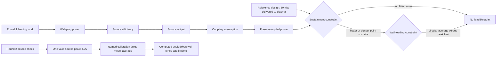

# Narrative: wall-and-heating

This is the human-facing engineering story of the goal. It summarizes cited records; it is not evidence, state, or a decision record. If this account and a cited source disagree, the source wins.

- **Goal status:** Grounded. Round 1 `heating-chain-first` closed and was independently reviewed on 2026-09-04. Round 2 `source-anchored-wall-fence` is open; its source-basis task returned and its wall-fence model task has started.
- **Narrative cutoff:** Provisional working tree over base commit `19b79f929df632af78992711e1b5a6bc5989f011` at 2026-09-04T18:42:54Z; uncommitted source content was included and the exact source state may not be recoverable from Git.
- **Review status:** Round 1's study reading, dispositions, result, eight learnings, and Row-4 re-grade were independently reviewed. Round 2's T-001 source-basis reading is complete but not yet covered by a fresh round review; T-002 has only started ([trail.md](../orchestration/goals/wall-and-heating/trail.md)).

## At a glance

- **Reference heating level:** The Stellaris reference design delivers 50 MW of auxiliary heating to the plasma. With the model's 50% source efficiency and 100% coupling assumption, producing that 50 MW requires 100 MW of electrical power at the wall plug.
- **Starting problem:** No evaluated design was feasible at that level. Lower-power plasma states needed more than 50 MW to sustain themselves. Hotter or denser states could reduce that shortfall, but many exceeded the wall-loading limit.
- **Heating defect:** The model did not represent the equipment between grid electricity and plasma heating. It held the plasma power and efficiency as separate inputs, divided one by the other inside another calculation, and charged a simple linear cost.
- **Wall defect:** The model divided neutron power by the area of a smooth circular torus, then compared that average with a published peak load on a shaped three-dimensional wall. The operand and limit did not describe the same quantity.
- **Round-1 model change:** The heating-system work item, WI-039, now calculates wall-plug power, heating-source output, and plasma-coupled power as a connected chain. The reference design's cost, power, and constraint results were preserved exactly.
- **Research result:** Published stellarator wall averages use shaped wall areas. On a comparable wall-side radius, the model's circular-torus area is 15% to 30% smaller than the published shaped-wall areas. A valid peak check also needs a peaking factor tied to the chosen wall shape.
- **Study result:** At fixed wall-plug power, a more efficient source produces more heating and costs more because the installed source output grows. At fixed power delivered to the plasma, higher efficiency lowers the electricity drawn by the heating system and sharply lowers plant cost.
- **Grade:** A fresh grader scored the heating half at its target. The chain is computed, its coupling assumption is stated, and an independent calculation verifies it; heating cost still follows delivered power at the sourced rate.
- **Round-2 source result:** The source-basis task found one valid printed peak, 4.05 MW/m². The printed 2.87 has no stated averaging basis and is not a wall average; the apparent 1.5 m radius and second 4.95 peak were extraction artifacts. A fully sourced calibration makes the model's reference peak 4.087, so it narrowly fails ([source-basis reading](../orchestration/goals/wall-and-heating/evidence/round2_T-001_source_basis.md)).
- **Round-2 model task:** The wall-fence task has started. It must compute that peak, compare it with 4.05, use peak load for first-wall lifetime, preserve every heating result, and disclose the expected reference verdict and replacement-cost changes before any study runs ([trail.md](../orchestration/goals/wall-and-heating/trail.md)).

The authoritative state is [trail.md](../orchestration/goals/wall-and-heating/trail.md). The goal contract is [goal.md](../orchestration/goals/wall-and-heating/goal.md).

## Starting point and motivation

### Two constraints surrounded the operating point

The goal inherited a measured result from `priced-levers`. At 50 MW delivered to the plasma, 27 of 240 design points failed only the wall-loading constraint, while 6 failed only the conductor peak-field constraint.

Across the full 439-point study, the wall check failed 264 times. The wall was therefore the dominant blocker by count, although one low-cost candidate remained blocked only by the unpriced conductor ceiling. The reviewed evidence is in [priced-levers L-001](../orchestration/goals/priced-levers/learnings.md) and its [study synthesis](../../exploration/stellarator_e2e/studies/20260903-priced-levers/synthesis.md).

These results placed the design between two competing requirements. The plasma needs enough heating to replace its energy losses. Raising temperature or density can improve fusion production and sustainment, but it also increases neutron power deposited on the first wall.

### The wall constraint mixed an average with a peak

The wall-loading calculation divided total neutron power by the area of a smooth circular torus. That produced an average over the model's idealized wall.

The 4.05 MW/m² limit came from the peak neutron load on a shaped stellarator wall. Comparing the circular-torus average directly with that peak limit makes the pass/fail result difficult to interpret. The model's own comments acknowledged the mismatch.

### Heating mattered, but its equipment chain was absent

The model held plasma-coupled heating power as an input. It also held one combined efficiency and divided the coupled power by that efficiency inside the plant's recirculating-power sum.

This arithmetic produced a total electrical draw, but it did not distinguish the electricity bought by the plant, the output rating of the heating source, and the fraction of that output deposited in the plasma. Those quantities drive different physical constraints and different costs.

That representation earned Row 4 physics a score of 1 against a target of 2. The grader's exact objection is in [grading.md](../../.project/active/demo-depth-rubric/grading.md), cell R4.P.

The goal therefore has two parts. Round 1 makes the heating chain explicit and measurable. A later round must replace the inconsistent wall check with a like-for-like calculation.

## Story in one picture



The heating branch is implemented in [the WI-039 design](../completed/20260904_WI-039_heating-system-structure/design.md). The wall branch is now bounded by the completed [round-2 source-basis reading](../orchestration/goals/wall-and-heating/evidence/round2_T-001_source_basis.md), while its model change remains in progress.

## Research learnings

Two clean-room-screened research runs registered three usable wall-load sources. The task return and cross-source calculation are in [T-001_research_return.md](../orchestration/goals/wall-and-heating/evidence/T-001_research_return.md). These findings passed the round review with one correction, recorded below.

### Peak loading depends on wall shape

The registered sources report peak-to-average neutron-load ratios of roughly 1.5 to 2.1 for unoptimized stellarator walls. This ratio is often called a peaking factor.

It is not a universal property of the plasma. In one source, the same HELIAS-5 plasma produced factors from 1.12 to 1.69 when the wall shape changed. A value can therefore be transferred only with a defensible wall-geometry argument.

### The area comparison must use the wall radius

Published shaped-wall areas initially appeared to differ by about 24% when each was divided by the circular-torus expression `4π²Ra`. Much of that disagreement came from using plasma minor radius for `a`.

The first wall sits outside the plasma. Using plasma radius silently folds the plasma-to-wall gap into the apparent shape factor.

When the comparison uses wall-side radius, the source that publishes a 0.30 m standoff gives shaped-wall area factors from 1.146 to 1.303. In plain terms, those walls have about 15% to 30% more area than a circular torus at the same wall-side radius.

The model uses a 0.10 m plasma-to-wall standoff. The published factors therefore cannot be copied directly without explaining how the different standoff affects the comparison.

### Both possible wall checks require shaped area

One option is to calculate peak load: divide neutron power by shaped-wall area, then multiply by a peaking factor for that wall. The other option is to compare an average load with a sourced average limit.

Both options require the shaped-wall area. Merely multiplying the current circular-torus average by a peak factor would still combine incompatible geometric definitions.

### The likely correction is large enough to change the reference verdict

For scale, the closest matched area-and-peaking pair in one source gives a net multiplier of 1.475 on the model's current circular-torus average. Applying it to the reference value raises wall load from 3.105 to 4.58 MW/m², above the present 4.05 MW/m² limit.

This is not a prediction for the modeled machine because the source uses a different wall standoff. It shows that the correction is large enough to turn a passing reference point into a failing one, so the next round must disclose and explain that possibility instead of tuning it away.

### Round 2 separated valid source data from extraction artifacts

The round-2 source task checked the Stellaris page images and extraction decisions. Its 2.87 value has no stated basis and cannot be a wall average: 2700 MW divided by the printed 940 m² plasma surface reproduces 2.872, while the damage map implies an average near 2.28. The apparent 1.5 m reference radius came from rewritten extraction text ([source-basis reading](../orchestration/goals/wall-and-heating/evidence/round2_T-001_source_basis.md)).

The page images support one printed peak: 4.05 MW/m² on the design's own CAD first wall. The supposed 4.95 peak was another extraction artifact; it is not present in the cited table. The peak came from the source's deterministic three-dimensional method, not an OpenMC tally ([source-basis reading](../orchestration/goals/wall-and-heating/evidence/round2_T-001_source_basis.md)).

The task therefore anchored the model to 4.05 directly. A named calibration built only from printed or modeled factors reproduces that source point and gives 4.087 MW/m² at the model baseline ([source-basis reading](../orchestration/goals/wall-and-heating/evidence/round2_T-001_source_basis.md)).

The source also sets first-wall lifetime by peak load. Using it would shorten modeled life from 5.797 to 4.404 years and increase planned replacements from four to five ([source-basis reading](../orchestration/goals/wall-and-heating/evidence/round2_T-001_source_basis.md)).

### The research process exposed two source-handling problems

- The source registry accepted an IOP bot-check page as if it were a paper. The registry has no supported unregister operation, so the bad entry remains in place with a warning that points to the correctly registered paper.
- A barred paper about a concept named `Helios` appeared beside admissible `HELIAS` reactor results. The one-letter difference confirms why the clean-room screen must run before a research agent retrieves a source.

Both issues are recorded in [the research return](../orchestration/goals/wall-and-heating/evidence/T-001_research_return.md).

## Model changes

WI-039 replaced the typed-in efficiency ratio with a named, executable equipment chain. The native [spec](../completed/20260904_WI-039_heating-system-structure/spec.md), [design](../completed/20260904_WI-039_heating-system-structure/design.md), and [implementation record](../completed/20260904_WI-039_heating-system-structure/plan.md) carry the requirements, architecture, and validation.

```text
wall-plug electrical power
  × source efficiency
= source-output heating power
  × coupling/deposition fraction
= plasma-coupled heating power
```

### Each quantity now has one engineering role

- **Wall-plug power** is the electrical power drawn from the plant. It is the input to the chain and contributes to the plant's recirculating load.
- **Source efficiency** is the fraction of wall-plug electricity converted to gyrotron output. Its default is 0.50, matching the reference costing model.
- **Source-output power** is the gyrotron output rating. Heating capital follows this quantity because the cost basis is a price per megawatt of gyrotron output.
- **Coupling or deposition fraction** is the share of source output that reaches the plasma. It is currently an explicit 1.00 assumption, which is optimistic rather than sourced.
- **Plasma-coupled power** is the result used by the sustainment constraint. A design passes only if this delivered power meets the plasma's calculated requirement.

Three old entry points were retired and five heating-chain inputs were introduced. The old study rule that manually forced two heating values to move together was removed because both values now descend from the same wall-plug input.

### The reference design stayed numerically unchanged

At the default 50% source efficiency and 100% coupling assumption, 100 MW at the wall plug produces 50 MW of gyrotron output and delivers the same 50 MW to the plasma.

The levelized cost of electricity remains 307.087120428 $/MWh. Heating capital remains 264.145 million dollars, and all nine pass/fail constraint results are unchanged.

This exact preservation matters because it isolates the effect of the new structure. Any movement in the study comes from varying a now-explicit engineering quantity, not from accidentally changing the reference case.

### An independent calculation checks the chain

The independent checking calculation, called the oracle in the study workflow, recomputes the heating chain from the equations rather than reading back the model's answer.

When source efficiency changes from 0.50 to 0.45, the generated model and the independent calculation agree on heating capital, levelized cost, the electricity consumed by the plant itself, and net electric power.

The integration checks confirmed that the generated study package came from this model state. All ten checks passed on the first run for package version `2649e0ea…`; the return is [T-003_integration_return.json](../orchestration/goals/wall-and-heating/evidence/T-003_integration_return.json).

At this cutoff, round 2 has not changed the model. Its T-002 scope requires a computed source-anchored peak, peak-driven lifetime, independently reproduced baseline changes, and restated study expectations; only the scope and start are recorded ([trail.md](../orchestration/goals/wall-and-heating/trail.md)).

## Study results

The study executed 639 points in four experiment groups. Its design is in [study.py](../../exploration/stellarator_e2e/studies/20260903-wall-and-heating/study.py), and its executor-written interpretation is in [record.md](../../exploration/stellarator_e2e/studies/20260903-wall-and-heating/record.md).

The detailed data are [results/points.csv](../../exploration/stellarator_e2e/studies/20260903-wall-and-heating/results/points.csv) and [results/oracle_operands.csv](../../exploration/stellarator_e2e/studies/20260903-wall-and-heating/results/oracle_operands.csv). An independent administrator recounted every number below ([synthesis.md](../../exploration/stellarator_e2e/studies/20260903-wall-and-heating/synthesis.md)), a fresh checkpoint passed the dispositions drawn from them, and the round review confirmed the counts.

### The 50 MW reference level still has no feasible point

At 100 MW wall-plug power and 50% source efficiency, the chain delivers the reference 50 MW to the plasma. None of the 240 evaluated design points passed every constraint.

Thirty-six points failed sustainment alone and could, in principle, be rescued by better source efficiency. The easiest of those points required 87.061 MW delivered to the plasma.

With wall-plug power fixed at 100 MW and coupling assumed to be perfect, the required source efficiency is therefore at least 0.871. The model's reference value is 0.50, and the executed study tested 0.40 to 0.60.

The remaining 204 points also failed wall loading or peak conductor field. Better heating efficiency cannot repair those failures. This holds under the wall check as currently built. The reviewer showed that with the wall verdict set aside, the level would open near efficiency 0.24, so the printed level's fate is the wall's, not the heating system's.

### At fixed wall-plug power, higher efficiency raises cost

The fixed-wall-plug experiment held grid draw at 220 MW and held the plasma operating point constant. As source efficiency increased from 0.35 to 0.65, plasma-coupled power increased from 77 MW to 143 MW.

The gyrotron source must be larger to produce that extra output, so heating capital rose from 406.78 million dollars to 755.45 million dollars. Wall-plug draw did not fall because the experiment held it fixed.

Levelized cost therefore increased from 269.823 to 273.675 $/MWh. At this particular operating point, better efficiency buys enough delivered power to cross the sustainment constraint near efficiency 0.524, but additional delivered power does not improve the prescribed plasma state.

### At fixed plasma power, higher efficiency lowers cost

The second experiment held plasma-coupled power at 132 MW. Increasing source efficiency from 0.35 to 0.75 reduced the wall-plug requirement from 377.14 MW to 176.0 MW.

Heating capital remained constant because the source still produced 132 MW. The plant simply consumed less of its own electricity to run that source.

The recirculating-power fraction fell from 0.4499 to 0.3096, and net electric output rose from 788.66 MW to 989.81 MW. Levelized cost fell from 317.234 to 255.970 $/MWh, with smaller gains at the high-efficiency end.

These two experiments have opposite signs because they hold different equipment quantities constant. “Better efficiency reduces cost” is true when the required plasma heating is fixed. It is not true when the wall-plug installation is fixed and efficiency is used to produce more plasma power.

### The higher-power search is controlled by the wall model

At 220 MW wall-plug power, 91 of 384 search points passed all constraints as currently implemented. The lowest-cost point in that search was:

| Quantity | Value |
|---|---:|
| Levelized cost of electricity | 267.159 $/MWh |
| Coil current | 14.25 MA |
| Ion temperature | 16 keV |
| Density | Reference value |
| Source efficiency | 0.60 |
| Plasma-coupled heating | 132 MW |

Its current wall-load calculation is 4.004 MW/m², just below the 4.05 MW/m² limit. Under the study's low wall-correction estimate, the value becomes 4.604 MW/m² and the point fails.

The low correction leaves 51 of the 91 passing points and raises the cheapest survivor to 326.201 $/MWh; the high correction leaves none. The apparent optimum therefore depends on a wall calculation known to mix geometry and loading definitions ([points.csv](../../exploration/stellarator_e2e/studies/20260903-wall-and-heating/results/points.csv)).

The external sources support a 1.15 to 1.83 range for an unoptimised wall at 0.30 m standoff. Under the machine source's 1.316 calibration, 26 points survive and the cheapest costs 371.005 $/MWh ([source-basis reading](../orchestration/goals/wall-and-heating/evidence/round2_T-001_source_basis.md)).

### What WI-039 actually added

The old model could already show the falling fixed-plasma-power cost curve by varying its lumped efficiency. That trend is not new evidence created by WI-039.

The new capability is narrower and more useful. Source efficiency now changes the plasma-coupled power used by the sustainment constraint, and the model can directly represent a fixed wall-plug installation without manually coordinating two unrelated inputs.

The pre-execution critique that forced this distinction is [T-004_precritique.md](../orchestration/goals/wall-and-heating/evidence/T-004_precritique.md).

## Outcome and follow-on issues

Round 1 closed on 2026-09-04 with its intent met. A fresh grader scored the heating half at its target: physics 2 because the chain is computed, stated, and independently checked; cost 2 because heating capital still follows delivered power at the sourced rate ([fresh re-grade](../../.project/active/demo-depth-rubric/grading-r4-regrade.md)).

The 1.00 coupling fraction remains an optimistic assumption, so the feasibility results use the most generous coupling ([fresh re-grade](../../.project/active/demo-depth-rubric/grading-r4-regrade.md)).

Round 2's first task is complete but has not yet passed a fresh round review. It disproved the assumption that the 2.87 basis could be established, then showed the wall fence does not need it: the source's 4.05 peak can calibrate the model directly, with the external papers retained as bounds ([source-basis reading](../orchestration/goals/wall-and-heating/evidence/round2_T-001_source_basis.md)).

The wall-load model task has started from that narrower basis ([trail.md](../orchestration/goals/wall-and-heating/trail.md)).

The owner accepted the round-1 restatement, archived WI-039, and pushed the branch; merging remains owner-held. The source-unregister and blank-column defects moved to the coding backlog. The Pierro paper supports the 0.4% strain limit as conservative. The next rubric must reflect the owner's ruling that a direct constraint alone is not modeled pushback ([owner rulings](../orchestration/goals/wall-and-heating/trail.md)).

Other limits remain. At fixed density and temperature, fusion does not respond to extra heating, so efficiency changes equipment power and feasibility rather than plasma state. Multi-output values do not reach the evidence store and are exported by the independent calculation. The reference-costing interface was already broken before WI-039 and remains broken ([round review](../orchestration/goals/wall-and-heating/evidence/round1_review.md)).

## Evidence and visual index

| Visual | What it can honestly show | Source |
|---|---|---|
| Heating-chain block diagram | Wall-plug power through source efficiency and coupling to plasma power, cost, recirculation, and sustainment | [WI-039 design](../completed/20260904_WI-039_heating-system-structure/design.md), [heating-chain model](../../models/library/analyses/mfe_heating_chain.sysml) |
| Wall geometry comparison | Circular-torus area versus shaped-wall area on plasma-radius and wall-side-radius conventions | [T-001 research return](../orchestration/goals/wall-and-heating/evidence/T-001_research_return.md) |
| Peak-factor range | The 1.5 to 2.1 unoptimised range and the dependence on wall shape | [T-001 research return](../orchestration/goals/wall-and-heating/evidence/T-001_research_return.md) |
| Fixed-wall-plug efficiency curve | Rising levelized cost and the sustainment crossing near efficiency 0.524 | [points.csv](../../exploration/stellarator_e2e/studies/20260903-wall-and-heating/results/points.csv), [study.py](../../exploration/stellarator_e2e/studies/20260903-wall-and-heating/study.py) |
| Fixed-coupled-power efficiency curve | Levelized cost, plant self-consumption, and net power improvements as efficiency rises | [points.csv](../../exploration/stellarator_e2e/studies/20260903-wall-and-heating/results/points.csv), [independently calculated operands](../../exploration/stellarator_e2e/studies/20260903-wall-and-heating/results/oracle_operands.csv) |
| Current versus corrected wall constraint | Current “feasible” high-power points and their low/high wall-load correction estimates | [points.csv](../../exploration/stellarator_e2e/studies/20260903-wall-and-heating/results/points.csv), [pre-execution critique](../orchestration/goals/wall-and-heating/evidence/T-004_precritique.md) |
| Source-anchored wall check | One valid 4.05 peak, the 2.87's unstated basis, extraction-artifact corrections, the calibrated 4.087 model baseline, and peak-driven lifetime | [round-2 source-basis reading](../orchestration/goals/wall-and-heating/evidence/round2_T-001_source_basis.md) |
| Round status timeline | Round 1 reviewed and closed; round 2 source basis complete but unreviewed; wall-fence model task started | [trail.md](../orchestration/goals/wall-and-heating/trail.md) |
