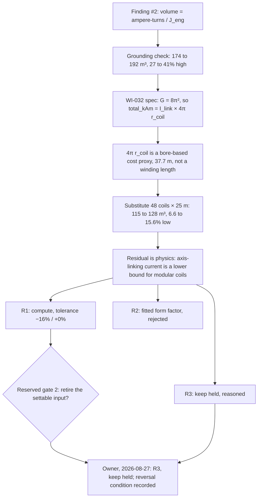

# Narrative: cryo-volume-basis

This is the human-facing engineering story of the goal. It summarizes cited records; it is not evidence, state, or a decision record. If this account and a cited source disagree, the source wins.

- **Goal status:** Closed by owner ruling after one round. This is an ordinary close, not a redirect: the owner ruled the reserved gate as "keep it held", which answered the goal on its "no" branch as a bounded negative.
- **Goal closed:** 2026-08-27, at approximately 17:07 UTC (`e891b23a`; Git commit-time proxy). The close entry carries a date but no time. Date and disposition come from [the owner close entry](../orchestration/goals/cryo-volume-basis/trail.md#goal-close--2026-08-27).
- **Narrative cutoff:** Clean sources at base commit `f690b0cda619cc74994d12dbf9782d4833f69492`, generated 2026-09-04 at 21:54 UTC. The goal files and every cited native record were clean in Git at that commit.
- **Review status:** Mixed. The round 1 result and the three learnings were checked by a fresh round 1 review, which reproduced the arithmetic and returned `FINDINGS` with no evidence error. The owner's close ruling is an owner decision and was not reviewed. The sensitivity numbers come from a study addendum that labels them oracle-side, not package evidence. The after-close model state noted at the end is outside this goal's evidence and unreviewed here.

## At a glance

- **The question:** Should the winding-pack cold volume, the volume of superconducting coil the cryoplant must keep at 20 K, be computed from the coil current the model already carries and a sourced current density, instead of being typed in as 136.56 m³ for Stellaris? Source: [goal.md](../orchestration/goals/cryo-volume-basis/goal.md).
- **What the derivation found:** The proposed identity does not hold. The model's "ampere-turns" is a cost proxy built on the coil bore radius, not a winding length. Dividing it by the current density gives 174 to 192 m³, 27 to 41% above the held value.
- **With the real winding length:** Using Stellaris's 48 coils at 25 m each, the sourced current-density band gives 115 to 128 m³, 6.6 to 15.6% below the held value. Ampère's law on the magnetic axis under-counts the current in modular stellarator coils.
- **The decision:** On 2026-08-27 the owner ruled to keep the volume held. The knob stays a sweepable design parameter, the held number is double cross-checked, and swinging the volume across its sourced range turns no viability verdict.
- **Where it ended:** The goal closed as a bounded negative in one round. Work item WI-032 closed at spec, and discovery row #2 carries a final disposition. The reversal condition is a future study whose verdicts turn on cryoplant load.
- **Since the close:** A later item under another goal computed the winding-pack volume in the model while keeping the input settable, citing this ruling as the boundary it worked within. That is outside this goal's evidence.

## Starting point and motivation

### A study finding said the volume should follow from two things the project already had

The magnet-technology A/B study of 2026-08-23 compared a REBCO coil set with a Nb₃Sn one. Its record sighted finding #2: the model already computes coil ampere-turns, DI-010 gives the engineering current density per conductor, so the cold volume should follow from the two. The row sat `unrouted`. Source: [record.md § 15](../../exploration/stellarator_e2e/studies/20260823-magnet-technology-ab/record.md) and [DISCOVERY_LOG.md](../../exploration/stellarator_e2e/studies/DISCOVERY_LOG.md).

### What the model did at the time

At the cited model state, the Stellaris design bound `vol_cold_cryo = 136.56` as a literal. Its doc comment showed the geometric arithmetic a person had done: six winding-pack cross-sections, eight occurrences each, 25 m typical circumference.

The value fed one chain only: cryoplant heat load, cryoplant electrical power, the power balance, then recirculating fraction and net power. Source: [goal.md § Grounding evidence](../orchestration/goals/cryo-volume-basis/goal.md#grounding-evidence), citing the design file at commit `ba5c9945` and the cryo chain at `8f3b510c`.

### The grounding check ruled out the easy answer

Before the goal opened, the grounding session divided the model's own ampere-turn quantity by DI-010's REBCO band. It got 192.4, 182.6, and 173.8 m³ at 112, 118, and 124 A/mm², all well above 136.56. Reproducing the held value would need 157.8 A/mm², outside the sourced band.

So "the identity already holds, just wire it up" was ruled out before any round ran. Source: [goal.md § Grounding evidence](../orchestration/goals/cryo-volume-basis/goal.md#grounding-evidence).

### What "answered" meant

The operator, acting under delegated authority, set the finish line in both directions. "Yes" meant a modeling item lands the computation and reproduces 136.56 m³ within a stated tolerance. "No" meant recorded reasoning stands as the answer. Either way, discovery row #2 had to leave `unrouted`. Source: [goal.md § Answered when](../orchestration/goals/cryo-volume-basis/goal.md#answered-when).

Retiring the volume as a settable input was reserved gate 2, owner-held, because a committed study defines its two arms partly by that value. A computed volume would make that study's arms non-reproducible as written. Source: [goal.md § Reserved gates](../orchestration/goals/cryo-volume-basis/goal.md#reserved-gates).

## Story in one picture

The diagram shows how the derivation moved from the finding's proposed identity to three routes, and which one the owner chose. The arithmetic is in [the WI-032 spec](../completed/20260827_WI-032_cold-volume-basis/spec.md#what-g-is-and-where-the-gap-comes-from) and the ruling in [the trail's goal close](../orchestration/goals/cryo-volume-basis/trail.md#goal-close--2026-08-27).

| Current density (A/mm²) | Volume via the model's proxy length (m³) | Volume via 48 coils × 25 m (m³) | Winding-length route vs held 136.56 |
|---|---|---|---|
| 112 | 192.4 | 127.57 | −6.6% |
| 118 | 182.6 | 121.08 | −11.3% |
| 124 | 173.8 | 115.22 | −15.6% |

The table compares the two derivation routes across DI-010's sourced REBCO band. Reproducing 136.56 m³ needs 157.8 A/mm² by the proxy route and 104.6 A/mm² by the winding-length route, both outside the band.

Read from the held value instead, the winding packs carry 7.0 to 18.5% more ampere-turn-metres than the axis law counts. All figures were recomputed by [the round 1 review](../orchestration/goals/cryo-volume-basis/trail.md#round-1-review--2026-08-26).

## Research learnings

Three learnings were accepted by the fresh round 1 review on 2026-08-26 and recorded in [learnings.md](../orchestration/goals/cryo-volume-basis/learnings.md). No new source was ingested. The goal worked from the magnet cost calc, the design file's doc comment, and DI-010 in [KNOWLEDGE.md](../../knowledge/KNOWLEDGE.md).

### The model's ampere-turn quantity is a cost proxy, not a winding length

The magnet cost calc's geometry constant `G` equals 8π² to every printed digit. The expression therefore factors exactly into an Ampère's-law current linking the magnetic axis, 5.715e8 A at the Stellaris point, times a stand-in length of 4π times the coil bore radius, 37.7 m.

The bore radius comes from the radial build, so the length is not a conductor length. Source: [L-001](../orchestration/goals/cryo-volume-basis/learnings.md#l-001--total_kam-is-a-cost-proxy-not-a-count-of-winding-ampere-turn-metres).

Implication: any conductor volume needs a winding length, and the package carried none. Neither coil count, coil circumference, nor current density appeared anywhere under `models/` at the cited state. The review re-ran that grep.

### Ampère's law on axis under-counts modular stellarator coil current

With Stellaris's own geometry substituted, the sourced current-density band lands 6.6 to 15.6% below the held 136.56 m³. Read the other way, the winding packs carry 7.0 to 18.5% more ampere-turn-metres than the axis-linking law accounts for. The review corrected the round's rounded "7–18%" to the exact band, because the upper end sets how wide any tolerance must be.

The physical reading, that a modular quasi-isodynamic coil set's shaping currents largely do not link the axis, is the round's inference. No source in the repository states it. The review marked it agent-grade, to be challenged by re-deriving, not by asking the owner. Source: [L-002](../orchestration/goals/cryo-volume-basis/learnings.md#l-002--ampères-law-on-the-magnetic-axis-is-a-lower-bound-on-modular-stellarator-coil-current-not-an-estimate-of-it).

### The case for computing was the Nb₃Sn arm, not the REBCO arm

The held 136.56 m³ has two independent cross-checks in its own doc comment: each winding-pack side squared equals turns times a 20 mm pitch squared, and the printed no-casing masses imply 7539 kg/m³, consistent with the material mix. Arm B's 390 m³, by contrast, is a hand ratio scaled off arm A's held number. Source: [L-003](../orchestration/goals/cryo-volume-basis/learnings.md#l-003--the-case-for-computing-this-volume-is-arm-b-not-arm-a) and [study.py](../../exploration/stellarator_e2e/studies/20260823-magnet-technology-ab/study.py).

Computing would have made arm B derive from the same formula at Nb₃Sn's own current density and ceiling field. The spec argued the recommendation on that ground, and the review found the argument sound.

## Model changes

### No model changed under this goal

The round declared one intended increment, a computed `vol_cold_cryo` in the Stellaris design file, and it did not land. The round 1 review verified that the round's commits touched only the goal files, the backlog registry, the discovery log, and the WI-032 spec. Nothing under `models/`, `knowledge/`, or the exploration twin moved. Source: [round 1 review](../orchestration/goals/cryo-volume-basis/trail.md#round-1-review--2026-08-26).

### What the spec proposed, had the gate opened

Five gated requirements are on record in [the WI-032 spec](../completed/20260827_WI-032_cold-volume-basis/spec.md#modeling-requirements--proposed-gated). None was authorized.

- **Formula:** the axis-linking current times coil count times circumference, divided by current density, with the printed 136.56 m³ kept in the doc as the cross-check.
- **Tolerance:** −16% / +0% against the anchor, with the shortfall documented as shaping current, not a data error.
- **Placement:** a new library calc def carrying no concept values; coil count, circumference, and current density bound in the Stellaris design.
- **The committed study:** arm B restated by current density and ceiling field, and the study's non-reproducibility disclosed rather than silently broken.
- **Rejected route:** a form factor fitted at the design point, because a value calibrated to the point it is validated against cannot be validated.

The review's first finding: the increment had widened to a new library calc def, which the library-stays-concept-agnostic rule requires, and the round result did not say so. It became moot at the close.

## Study results

### No study ran under this goal

The round committed no study question. The `integrate` seam, the step that regenerates and pins a package after a model change, had no native procedure and no documented hand pattern. Any landed model change would have stopped at a `PREREQUISITE` return to the operator. Source: [the strategy revision](../orchestration/goals/cryo-volume-basis/trail.md#strategy-revision--2026-08-26) and [goal.md § Grounding evidence](../orchestration/goals/cryo-volume-basis/goal.md#grounding-evidence).

### The prior study's sensitivity read is what the decision leaned on

The magnet-technology A/B's certification addendum re-evaluated the Nb₃Sn arm's closing node across every sourced combination of cryoplant Carnot fraction and cold volume. The record labels these numbers oracle-side re-evaluations, not package evidence. Source: [record.md, certification addendum](../../exploration/stellarator_e2e/studies/20260823-magnet-technology-ab/record.md#addendum-2026-08-23-certification).

| Carnot fraction | Cold volume (m³) | Recirculating fraction |
|---|---|---|
| 0.20 | 390 | 0.516 |
| 0.20 | 285 | 0.511 |
| 0.24 | 390 | 0.511 |
| 0.24 | 285 | 0.508 |
| 0.30 | 390 | 0.507 |
| 0.30 | 285 | 0.504 |

Every value stays above the 0.50 recirculation threshold, so the Nb₃Sn arm stayed infeasible and the headline did not depend on the held volume. Swinging the volume from 390 to 285 m³ at fixed Carnot fraction moves the fraction by 0.005. The margin narrows to 0.004 under the most favourable values. Source: the same addendum.

## Outcome and follow-on issues

### The owner ruled: keep it held

On 2026-08-27 the owner ruled reserved gate 2 as R3. The recorded basis: the product frame, in which the system sets design parameters and observes performance, so the knob stays sweepable; the measured sensitivity turning no verdict; the held value being the better number at the anchor; and the committed study staying reproducible as written. Source: [the goal close](../orchestration/goals/cryo-volume-basis/trail.md#goal-close--2026-08-27).

Effects recorded at the close:

- **Answered:** the goal's "no" branch is met. The reasoning lives in the WI-032 spec and the trail.
- **WI-032:** closed as a `BOUNDED_NEGATIVE` and archived. Its [open-decisions section](../completed/20260827_WI-032_cold-volume-basis/spec.md#open-decisions-for-the-owner) records the ruling and marks the other two decisions moot.
- **Discovery row #2:** a final `model fix` disposition, closed by owner ruling. Source: [DISCOVERY_LOG.md](../../exploration/stellarator_e2e/studies/DISCOVERY_LOG.md).
- **Reversal condition:** reopen through a new work item if a future study's verdicts turn on cryoplant load. The derivation stands ready in the spec.

### Limits the record states

- **The physics is an inference.** The shaping-current explanation of the residual has no source behind it (L-002).
- **The 25 m circumference is approximate.** Per-coil circumferences are not printed in the Stellaris source, as the design file's own doc comment says. Source: [goal.md § Grounding evidence](../orchestration/goals/cryo-volume-basis/goal.md#grounding-evidence).
- **The sensitivity numbers are oracle-side.** No package point was run for them. Source: [the certification addendum](../../exploration/stellarator_e2e/studies/20260823-magnet-technology-ab/record.md#addendum-2026-08-23-certification).
- **Round 1 crossed three session boundaries** under an operator ruling, which waived the one-agent-per-round property. The review recorded it as a constraint for any round 2. None was needed.
- **The goal was the subject of a kept process proof run.** The operator's brief seeded one frame widening, which the round agent narrowed back, and the T-001 interruption was staged. The trail's disclosure says everything else is real work on the real question. Source: [the trail amendment](../orchestration/goals/cryo-volume-basis/trail.md#amendment-2026-08-26--amends-nothing-above-discloses-proof-context).
- **A registry disagreement predates the goal.** The backlog registry listed the MFE Cost Modeling epic as `draft` while the epic file read `active`. Noted by the review as not this goal's to fix.

### The model has moved since the close

At this cutoff the Stellaris design file no longer holds 136.56 m³ as a literal. Work item WI-036, under goal `priced-levers`, computed the winding-pack cold volume in the model from the sized cross-section and winding length, reproducing 136.56 m³, and rebound `vol_cold_cryo` to zero as additional cold volume beyond the pack.

That item's doc comment reads this goal's ruling as barring retirement of the settable input, not modelling of the chain behind it. That reading is WI-036's, outside this goal's evidence, and unreviewed here. Source: [the design file](../../models/designs/stellarator_09/stellarator_plant.sysml) and [the WI-036 spec](../completed/20260903_WI-036_winding-pack-sizing/spec.md).

## Evidence and visual index

| Visual | What it can honestly show | Source |
|---|---|---|
| Derivation-to-decision flowchart | How the finding's identity failed, split into a length form factor and a physical residual, and led to three routes and one owner ruling | [WI-032 spec](../completed/20260827_WI-032_cold-volume-basis/spec.md), [goal close](../orchestration/goals/cryo-volume-basis/trail.md#goal-close--2026-08-27) |
| Two-route volume table | The proxy route overshoots and the winding-length route undershoots the held anchor across the sourced band | [WI-032 spec](../completed/20260827_WI-032_cold-volume-basis/spec.md), [round 1 review](../orchestration/goals/cryo-volume-basis/trail.md#round-1-review--2026-08-26), [DI-010](../../knowledge/KNOWLEDGE.md) |
| Sensitivity table | The Nb₃Sn arm stays infeasible across every sourced cryo combination, so the held volume did not decide the headline | [certification addendum](../../exploration/stellarator_e2e/studies/20260823-magnet-technology-ab/record.md#addendum-2026-08-23-certification) |
| Owner ruling and reversal condition | What was decided, why, and what would reopen it | [goal close](../orchestration/goals/cryo-volume-basis/trail.md#goal-close--2026-08-27), [WI-032 spec](../completed/20260827_WI-032_cold-volume-basis/spec.md#open-decisions-for-the-owner), [DISCOVERY_LOG.md](../../exploration/stellarator_e2e/studies/DISCOVERY_LOG.md) |
| After-close model state | The winding-pack volume is now computed elsewhere while the input stays settable | [design file](../../models/designs/stellarator_09/stellarator_plant.sysml), [WI-036 spec](../completed/20260903_WI-036_winding-pack-sizing/spec.md) |

Authoritative records behind this narrative: [goal.md](../orchestration/goals/cryo-volume-basis/goal.md), [trail.md](../orchestration/goals/cryo-volume-basis/trail.md), [learnings.md](../orchestration/goals/cryo-volume-basis/learnings.md), the [WI-032 spec](../completed/20260827_WI-032_cold-volume-basis/spec.md), the [magnet cost calc](../../models/library/analyses/mfe_magnet_cost.sysml) and [cryo chain](../../models/library/analyses/mfe_cryo_plant.sysml) at their cited digests, the [generic MFE plant](../../models/designs/generic_mfe/mfe_plant.sysml), and [work/BACKLOG.md](../BACKLOG.md).
