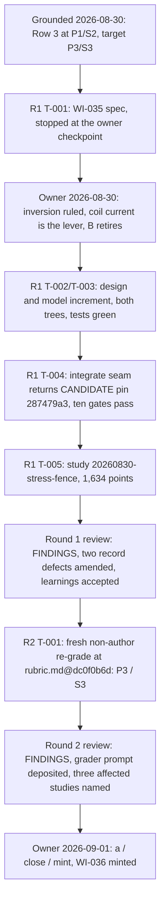

# Narrative: magnet-closure

This is the human-facing engineering story of the goal. It summarizes cited records; it is not evidence, state, or a decision record. If this account and a cited source disagree, the source wins.

- **Goal status:** Closed by owner ruling after two rounds. This is an ordinary close, not a redirect: the goal's "yes" branch was met, a fresh re-grade at the frozen rubric reading the target scores, and the owner ruled "a / close / mint" on the round 2 review's recommendation.
- **Goal closed:** 2026-09-01, at approximately 13:16 UTC (`6f6f520c`; Git commit-time proxy). The close entry carries a date but no time. Date and disposition come from [the owner ruling in the trail](../orchestration/goals/magnet-closure/trail.md#goal-close--2026-09-01).
- **Narrative cutoff:** Clean sources at base commit `f690b0cda619cc74994d12dbf9782d4833f69492`, generated 2026-09-04 at 22:00 UTC. The goal files and every cited native record were clean in Git at that commit.
- **Review status:** Mixed. Round 1's result and its three learnings were checked by a fresh round 1 review, which re-derived the field and stress arithmetic, recounted the study, re-ran the full test battery, and returned `FINDINGS` with two record defects, both amended. Round 2's result and learning were checked by a fresh round 2 review, `FINDINGS` again, four findings, two amended. The re-grade itself was produced by a clean-context non-author grader whose spawn prompt was recovered and deposited only after the fact. The owner's close ruling is a decision and was not reviewed. The provenance correction to reserved gate 1 is an owner correction recorded after the close. The after-close model state noted at the end is outside this goal's evidence and unreviewed here.

## At a glance

- **The question:** Can the magnet system's field, feasibility, and cost be derived from its own engineering design, instead of typed-in constants? Concretely: coil geometry and current give the field, a stress limit pushes back on coil sizing, and magnet cost splits into separately sized winding-pack, structure, and cryoplant accounts. Source: [goal.md § Question](../orchestration/goals/magnet-closure/goal.md#question).
- **The yardstick:** The demo depth rubric's Row 3, graded on two ladders, physics depth (P) and structure-and-cost depth (S), each 0 to 4. The goal started at P1/S2 with a target of P3/S3. Source: [rubric.md Row 3](../../.project/active/demo-depth-rubric/rubric.md) and [grading.md](../../.project/active/demo-depth-rubric/grading.md).
- **What changed:** Work item WI-035 made coil current the design lever and computed the field from it, added a winding-pack stress limit with a computed operand, and split magnet cost into a winding-pack account plus a casing-structure account. The old lump survives as a comparison channel.
- **What the study measured:** The new stress fence is the binding ceiling for major radius at or above 16.5 m, the coil-sizing flip sits between 0.28 and 0.30 m, and magnet capital fell 14.6% with every factor of the drop decomposed rather than fitted.
- **The measurement:** A fresh non-author re-grade at the same frozen rubric read R3.P 1 → 3 and R3.S 2 → 3. This is the demo epic's first measured maturation delta.
- **The decision:** On 2026-09-01 the owner accepted reading (a) of the "affected studies re-run clean" condition, closed the goal, and minted WI-036 for the residue: winding length and pack sizing are still held facts.
- **Where it stops:** Of the four sub-accounts the S3 anchor names, only the winding pack responds to a magnet design lever. The cryoplant account was exposed, not newly built. The owner closed knowing both.

## Starting point and motivation

### The magnet was the largest cost account and had no design response

At the pre-goal model state the axis field was a held 9.0 T, the peak field was that value times a held ratio, and the peak-field check compared a held product against a held ceiling. Magnet cost was conductor quantity times a 5.87 markup that swallowed winding, quench protection, cryostat, and testing. Source: [grading.md § Row 3](../../.project/active/demo-depth-rubric/grading.md).

The gap report put Row 3 in its top priority band: magnet capital was 39.3% of overnight capital, and a single field errata had swung it by $1.93B. Source: [gap-report.md § Priority bands](../../.project/active/demo-depth-rubric/gap-report.md).

### Two study findings had already named the gap

The magnet-technology A/B study of 2026-08-23 sighted two model findings. Finding #3: no coil-thickness or stress coupling exists, and the field ceiling enters only as a verdict bound. Finding #4: the field reaches no plasma channel but beta, so the optimum always sits at the lowest field the beta limit allows. Source: [DISCOVERY_LOG.md](../../exploration/stellarator_e2e/studies/DISCOVERY_LOG.md), rows of 2026-08-23.

### What "answered" meant

The agent drafted and the owner ratified both directions on 2026-08-30. "Yes" meant a fresh non-author re-grade against the frozen rubric scoring P3 and S3, with the validation battery green and affected studies re-run clean. "No" meant a sourced showing that the target needs an owner-gated reopening, followed by the owner's ruling. Source: [goal.md § Answered when](../orchestration/goals/magnet-closure/goal.md#answered-when).

Four reserved gates were recorded, including "reopening any owner scope ruling" over confinement and pumping power. The confinement half of that gate turned out not to be an owner ruling at all; see the correction under Outcome. Source: [goal.md § Reserved gates](../orchestration/goals/magnet-closure/goal.md#reserved-gates) and [§ Amendments](../orchestration/goals/magnet-closure/goal.md#amendments).

## Story in one picture

The diagram shows the causal chain from grounding to close: one derive-and-limit round produced the thing to measure, one measurement round measured it. Sources: [trail.md](../orchestration/goals/magnet-closure/trail.md) round entries and [the goal close](../orchestration/goals/magnet-closure/trail.md#goal-close--2026-09-01).

| Quantity | Before (model `dc0f0b6d`, package `f97f0848…`) | After WI-035 (pin `287479a3…`) |
|---|---|---|
| Axis field | held 9.0 T | computed from 48 coils, 15.4 MA, a held linkage factor, and R0; lands 1 ulp under 9.0 T |
| Structural limit | none | winding-pack stress 650 MPa against an allowable 800 MPa, margin 150 MPa |
| Magnet capital | $6.3235B, one lump | $5.401B = $5.3466B winding pack + $54.4M casing structure |
| Overnight capital | $16.090B | $14.574B |
| LCOE | 333.067 $/MWh | 304.482 $/MWh |
| Magnet share of overnight | 39.30% | 37.06% |
| Package entry points | 173 | 186 (field input retired, 12 magnet levers and 2 library defaults added) |
| Executing verdicts | 6 | 7 |
| Row 3 score (P / S) | 1 / 2 | 3 / 3 |

The table compares the model state at the two gradings. Headline moves are recorded as explained, not fitted, per the goal's comparison invariant. Sources: [the T-004 return](../orchestration/goals/magnet-closure/trail.md#t-004-return--2026-08-30), [the WI-035 design](../completed/20260901_WI-035_magnet-closure/design.md), and [grading-r3-regrade.md § Delta](../../.project/active/demo-depth-rubric/grading-r3-regrade.md).

## Research learnings

No new source was ingested. Every value came from the Stellaris design source already in the repository, read from page images because the text extraction was corrupted, and from the pinned 1costingFE constants. Five learnings are on record in [learnings.md](../orchestration/goals/magnet-closure/learnings.md).

### Image verification caught real corruption in the source tables

The text extraction of Stellaris Table 8 printed the wrong per-coil currents and coil masses, and Table 7's material fractions were wrong. The page images override, per the source index rule. The design records each correction. Source: [design.md § Research findings](../completed/20260901_WI-035_magnet-closure/design.md#research-findings).

### The target state became executed evidence, with a regime of its own

Round 1's first learning: a stress limit with a computed operand pushes back on both field choice and coil sizing, and the fence is the binding ceiling for major radius at or above 16.5 m rather than shadowing the conductor limit. Source: [learnings.md § Round 1](../orchestration/goals/magnet-closure/learnings.md), item 1.

### Held float64 facts anchored on printed pairs make an inverted derivation exact

No float64 linkage factor reproduces 9.0 T exactly. The design bound the side that cannot flip a verdict: the axis field lands one ulp under 9.0 T, so the conductor ceiling cannot turn on rounding. Source: [learnings.md § Round 1](../orchestration/goals/magnet-closure/learnings.md), item 2, and [design.md D2](../completed/20260901_WI-035_magnet-closure/design.md#design-decisions).

### Internalization relocates held facts rather than finishing them

Deriving the field exposed that the winding length (a 25 m typical circumference) and the pack side length are still held, with no cost consequence. Each internalization's residue is the next round's natural target. Source: [learnings.md § Round 1](../orchestration/goals/magnet-closure/learnings.md), item 3.

### The frozen-yardstick loop closes end to end

Both gradings cite the same rubric commit, and that commit is still the file's last touching commit. The delta is therefore a measurement, not a re-definition. Source: [learnings.md § Round 2](../orchestration/goals/magnet-closure/learnings.md), item 1, verified at [the round 2 review](../orchestration/goals/magnet-closure/trail.md#round-2-review--2026-09-01).

### Reaching a decomposition anchor is not sizing a subsystem from its own design

Reviewer-added on 2026-09-01. Of the four sub-accounts the S3 anchor names, only the winding pack responds to a magnet design lever. Structure is a held casing mass times coil count. Cryoplant is a power law over two held drivers. Power supplies carries no magnet quantity. Source: [learnings.md § Round 2](../orchestration/goals/magnet-closure/learnings.md), item 2.

## Model changes

### WI-035 landed three linked moves in one round

The item ran through the native modeling PM: spec with an owner checkpoint, design approved under delegation, plan and implementation with tests green in both model trees. The spec's seven requirements and the design's eight decisions are in the archived item. Sources: [spec.md](../completed/20260901_WI-035_magnet-closure/spec.md), [design.md](../completed/20260901_WI-035_magnet-closure/design.md), [plan.md](../completed/20260901_WI-035_magnet-closure/plan.md).

- **Field from coil current (D1, D2):** a new library calc computes the axis field from coil count, peak coil current, a held linkage factor, and major radius. The instance's held field binding is deleted, and the plant exposes the computed field into the magnet part so beta, peak field, and the comparison cost calc read it unchanged.
- **One limit that pushes back (D3):** winding-pack stress equals a held factor times current times peak field over pack side length, asserted against the source's 800 MPa design limit. Stress rises with current squared over radius and side length, so it resists both raising the field and shrinking the pack. Current-density margin and turn-current fences were considered and recorded as rejected.
- **Decomposed cost (D4, D5, D6):** a winding-pack account over the real winding length with a content-mapped fabrication markup, plus a casing-structure account from a printed per-casing mass floor. The rollup is their exact sum. The old conductor-proxy lump stays wired as a live comparison channel.
- **Cryoplant visibility (D7):** the existing aux-cooling account was split into two additive outputs and the cryoplant half exposed as its own channel. Same expression, bit-identical value. The held cold volume stays a settable input under the WI-032 ruling.
- **Committed-study restatement (D8):** written before regeneration. Two studies are not reproducible as written because their field axis retired or their radius sweep now moves the field. One replays up to a 1-ulp shift.

### The 14.6% magnet-capital drop is decomposed, not fitted

The design explains the move from $6.3235B to $5.401B factor by factor: real current 12.5% above the axis-linking estimate, real winding length 33.7% below the bore-based proxy, markup recomposed from 5.87 to 6.65, plus $54M of structure. Source: [design.md D6](../completed/20260901_WI-035_magnet-closure/design.md#design-decisions).

### The integrate seam proved one candidate pin

The regeneration hop and seam run returned `CANDIDATE` with all ten gates passing: byte-stable regeneration, handwritten implementations preserved, census as bound, spine suite green, manifest re-pinned, six preflight gates, oracle parity with every verdict re-derived, and lineage as named. One mechanical retry was needed after a stale executable fingerprint in the manifest. Source: [T-004_integration_return.json](../orchestration/goals/magnet-closure/evidence/T-004_integration_return.json) and [the T-004 return](../orchestration/goals/magnet-closure/trail.md#t-004-return--2026-08-30).

The round 1 review verified the pin, the field and stress arithmetic, the entry-point delta, and the standing rulings from the committed artifacts, and re-ran the battery itself: 398 passed, 14 skipped. Source: [round 1 review](../orchestration/goals/magnet-closure/trail.md#round-1-review--2026-08-30).

## Study results

### The stress fence has its own regime above 16.5 m

Study `20260830-stress-fence` ran two arms at the candidate pin: a grid over major radius 4 to 20 m and coil current 2 to 26 MA at a held pack side, and a pack-side transect at the baseline. Total 1,634 points, none excluded; verification re-derived all seven verdicts at worst relative deviation 4.37e-16. Source: [record.md § 4, § 13](../../exploration/stellarator_e2e/studies/20260830-stress-fence/record.md).

| Major radius | What bounds the feasible current band |
|---|---|
| 4.0 to 7.5 m | recirculation fraction kills every current; nothing is feasible |
| 8.0 to 15.0 m | beta floor below, conductor peak-field ceiling above |
| 15.5 to 16.0 m | beta floor below, both ceilings together above |
| 16.5 to 20.0 m | beta floor below, winding-pack stress ceiling alone above |

The table shows the ceiling identity handing over from the conductor limit to the new stress limit as the machine grows. The administrator recounted it exactly from the committed points file, and the round 1 review recounted it again. Sources: [synthesis.md § What it found](../../exploration/stellarator_e2e/studies/20260830-stress-fence/synthesis.md) and [record.md § 6](../../exploration/stellarator_e2e/studies/20260830-stress-fence/record.md).

### Coil sizing flips the verdict, but costs nothing

The pack-side transect flips the stress verdict between 0.28 m (835.7 MPa, violated) and 0.30 m (780.0 MPa, satisfied). Across the whole transect LCOE and magnet capital are bit-identical, which is the executed evidence that pack sizing reaches no objective. Source: [synthesis.md](../../exploration/stellarator_e2e/studies/20260830-stress-fence/synthesis.md), recounted at [the round 1 review](../orchestration/goals/magnet-closure/trail.md#round-1-review--2026-08-30).

### The constrained optimum is a fact about this frame

Of 1,617 grid points, 201 are feasible (12.4%). Minimum feasible LCOE: 236.634 $/MWh at 20.0 m and 18.0 MA, on the beta floor at the window's edge. The record scopes that claim: the held winding length keeps magnet capital flat in radius, so "optimum at large R" rides partly on a decomposition artifact. Sources: [record.md § 3](../../exploration/stellarator_e2e/studies/20260830-stress-fence/record.md), [synthesis.md](../../exploration/stellarator_e2e/studies/20260830-stress-fence/synthesis.md).

The three fences the increment should not have moved agree with the prior p-pump-fence study at every one of 33 shared radii, 99 of 99 verdicts. The administrator could not check this from inside the record; the round 1 review checked it from outside. Source: [round 1 review](../orchestration/goals/magnet-closure/trail.md#round-1-review--2026-08-30).

### The re-grade read the target on both ladders

A clean-context grader that authored neither the model change nor any review scored R3.P = 3 and R3.S = 3 at the frozen rubric, opening every citation itself. It attached five evidence-integrity findings, none blocking a level: two record defects already amended, and three disclosed assumptions (the on-fence-by-construction linkage factor, the casing-mass floor, the stress-factor extrapolation). Source: [grading-r3-regrade.md](../../.project/active/demo-depth-rubric/grading-r3-regrade.md).

The grader weighed three cruxes itself: whether one held linkage factor still counts as "computed from geometry and coil current", whether an exposed pre-existing cryoplant account is "separately sized", and whether the held winding length and costless pack side block a level. Its spawn prompt, recovered afterward, poses those as open questions with no target stated. Source: [round2_T-001_grader_prompt.md](../orchestration/goals/magnet-closure/evidence/round2_T-001_grader_prompt.md).

## Outcome and follow-on issues

### The owner ruled "a / close / mint"

On 2026-09-01, on the round 2 review's recommendation, the owner accepted reading (a): the new study running clean at the new pin plus the written restatement satisfies "affected studies re-run clean", with no translated re-run of the retired field axis required. The reading is recorded against all three affected studies by name. Source: [owner ruling](../orchestration/goals/magnet-closure/trail.md#owner-ruling--2026-09-01) and the amendment above it.

Effects recorded at the close:

- **Answered at target.** Row 3 moved from (1, 2) to (3, 3) at a yardstick that did not move.
- **WI-035 closed** on the same day through the modeling PM and archived; its path citations throughout the trail redirect to the archive. Item close, merge, and push were owner-held throughout.
- **WI-036 minted**, not started: the winding-pack sizing chain, joining sightings #1 and #2 of the stress-fence study. Its spec is told up front that the 25 m circumference is a printed typical value, so a geometry-derived length will need a coil-shape factor, and that the item is not a route to S4.
- **Disclosed at the close:** the cryoplant account was exposed, not newly sized, and only the winding pack responds to a magnet design lever.

### Limits the record states

- **Held facts still carry the chain.** Winding length, the set-mean current fraction, and pack side length are held; the winding-pack account cannot respond to coil geometry. Source: [DISCOVERY_LOG.md](../../exploration/stellarator_e2e/studies/DISCOVERY_LOG.md) rows for `20260830-stress-fence#1` and `#2`.
- **One constant carries the whole field transfer.** The axis field is exactly proportional to current over radius through a single held ratio. The round 1 review flagged this as what the re-grade would have to weigh; the grader accepted it as a held sourced coil-set fact of the kind the anchor permits.
- **The structure account is a floor.** Casing mass is bound at the printed 63 t floor of a 63 to 200 t range, with the band from $54.4M to $172.8M disclosed. Source: [design.md D5](../completed/20260901_WI-035_magnet-closure/design.md#design-decisions).
- **The baseline sits on the conductor fence by construction.** The 1-ulp-low linkage factor is a disclosed convention, not a robustness claim. The graded stress fence carries a real 23% margin.
- **Fabrication enters only as markups.** The winding-pack factor of 6.65 and the steel factor of 3.0 are content-mapped from the pin, not sized. This is why S4 is out of reach.
- **The validation entry's wording is close to the anchor's, and its author is the WI-035 author.** Inert here because the grader argued from the anchor. The round 2 review warns it would not stay inert if a future re-grade leaned on the flag.
- **A doc-comment citation no longer resolves.** The magnet rollup calc cites the item's live path, which moved on archive. Fixing it means editing a model file and invalidating the pin, so it rides the next regeneration done for a real reason. Source: [the path-redirect amendment](../orchestration/goals/magnet-closure/trail.md#goal-close--2026-09-01).

### A gate the rounds cited was never an owner ruling

Reserved gate 1 named "Rung C confinement" as an owner scope ruling. On 2026-09-01 the owner said no such ruling was ever made. The phrase began as an agent's scope note in a model doc comment, was recorded as agent-grade in the concept, then promoted to owner grade in the goal. Source: [goal.md § Amendments](../orchestration/goals/magnet-closure/goal.md#amendments) and [the concept's corrections](../../.project/concepts/stellarator-demo-maturation.md).

The effect on this closed goal: finding #4 of the magnet A/B study was never blocked by an owner gate, and both rounds' "blocked on Rung C" statements read as blocked on an unexamined agent note. Nothing in the scores depends on it: the strategy declined confinement coupling. The pumping-power ruling is real but narrower than the gate implied.

### The model has moved since the close

WI-036 closed on 2026-09-03 under goal `priced-levers`: the pack cross-section is now sized by current and a settable current density, the cold volume is computed, and a conductor-strain check exists. Source: [the WI-036 spec](../completed/20260903_WI-036_winding-pack-sizing/spec.md).

Finding #4 was routed to WI-037 under goal `operating-point-closure` and recorded as structurally discharged at a later pin. Both items are outside this goal's evidence and unreviewed here. Source: [DISCOVERY_LOG.md](../../exploration/stellarator_e2e/studies/DISCOVERY_LOG.md), rows of 2026-09-01.

Because later items edited the same library files, the line numbers in the re-grade deposit hold at its stamped model commit `ffa38c05`, not at the live files.

## Evidence and visual index

| Visual | What it can honestly show | Source |
|---|---|---|
| Grounding-to-close flowchart | The task sequence, the two owner rulings, the two fresh reviews, and where the measurement sat | [trail.md](../orchestration/goals/magnet-closure/trail.md) |
| Before/after table | What WI-035 changed at the design point and how both gradings read it | [T-004 return](../orchestration/goals/magnet-closure/trail.md#t-004-return--2026-08-30), [design.md](../completed/20260901_WI-035_magnet-closure/design.md), [grading-r3-regrade.md](../../.project/active/demo-depth-rubric/grading-r3-regrade.md) |
| Ceiling-handover table | The stress fence taking over from the conductor limit as radius grows | [synthesis.md](../../exploration/stellarator_e2e/studies/20260830-stress-fence/synthesis.md), [record.md](../../exploration/stellarator_e2e/studies/20260830-stress-fence/record.md) |
| Owner ruling and its disclosures | What was decided, on which reading, and what the owner knew when closing | [goal close](../orchestration/goals/magnet-closure/trail.md#goal-close--2026-09-01) |
| Gate provenance correction | Which half of reserved gate 1 was never an owner ruling | [goal.md § Amendments](../orchestration/goals/magnet-closure/goal.md#amendments) |

Authoritative records behind this narrative: [goal.md](../orchestration/goals/magnet-closure/goal.md), [trail.md](../orchestration/goals/magnet-closure/trail.md), [learnings.md](../orchestration/goals/magnet-closure/learnings.md), the goal's [evidence directory](../orchestration/goals/magnet-closure/evidence/T-004_integration_return.json), the archived [WI-035 item](../completed/20260901_WI-035_magnet-closure/spec.md), the rubric directory's [rubric.md](../../.project/active/demo-depth-rubric/rubric.md), [grading.md](../../.project/active/demo-depth-rubric/grading.md), [grading-r3-regrade.md](../../.project/active/demo-depth-rubric/grading-r3-regrade.md), [evidence-map-r3-regrade.md](../../.project/active/demo-depth-rubric/evidence-map-r3-regrade.md), and [gap-report.md](../../.project/active/demo-depth-rubric/gap-report.md), the [stress-fence study record](../../exploration/stellarator_e2e/studies/20260830-stress-fence/record.md) and [synthesis](../../exploration/stellarator_e2e/studies/20260830-stress-fence/synthesis.md), the [magnet A/B synthesis](../../exploration/stellarator_e2e/studies/20260823-magnet-technology-ab/synthesis.md), and [DISCOVERY_LOG.md](../../exploration/stellarator_e2e/studies/DISCOVERY_LOG.md).
