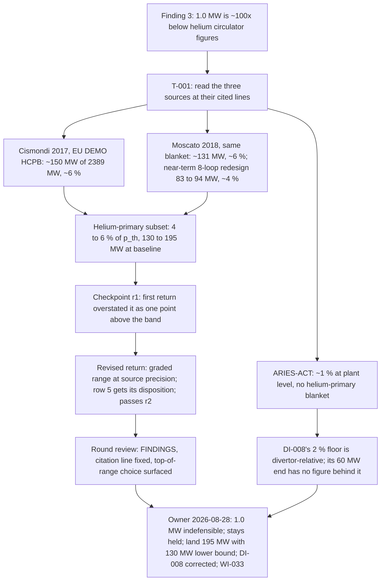

# Narrative: p-pump-basis

This is the human-facing engineering story of the goal. It summarizes cited records; it is not evidence, state, or a decision record. If this account and a cited source disagree, the source wins.

- **Goal status:** Closed by owner ruling after one round. This is an ordinary close, not a redirect: the owner ruled all three reserved gates the round referred, answered the question on its "no" branch, and routed the model change to work item WI-033.
- **Goal closed:** 2026-08-28, at approximately 18:16 UTC (`07b82c6d`; Git commit-time proxy). The close entry carries a date but no time. Date and disposition come from [the owner ruling](../orchestration/goals/p-pump-basis/trail.md#goal-close--2026-08-28).
- **Narrative cutoff:** Clean sources at base commit `f690b0cda619cc74994d12dbf9782d4833f69492`, generated 2026-09-04 at 22:06 UTC. The goal files and every cited native record were clean in Git at that commit.
- **Review status:** Mixed. The task reading passed a fresh disposition checkpoint on its second submission. The round result and the three learnings were checked by a fresh round 1 review, which recomputed the arithmetic and returned `FINDINGS` with two corrections and no evidence error. The owner's rulings are owner decisions and were not reviewed. The model change and the later fence study happened after close, under other records, and are labeled where they appear.

## At a glance

- **The question:** Is 1.0 MW a defensible primary-coolant pumping power for Stellaris, a helium-cooled stellarator of about 3240 MW thermal, and if not, what sourced value should the model carry? The owner's own wording, at [goal.md § Question](../orchestration/goals/p-pump-basis/goal.md#question).
- **What the model carried:** `p_pump` = 1.0 MW, inherited from a 1costingFE default with no justification document behind it. That is about 0.03 % of thermal power. Source: [goal.md § Grounding evidence](../orchestration/goals/p-pump-basis/goal.md#grounding-evidence).
- **What the sources say:** Helium-primary blanket circulators in EU DEMO designs draw about 4 to 6 % of thermal power. At the model's baseline that is roughly 130 to 195 MW, a factor of 130 to 195 above the held value. Source: [trail, T-001 return r2](../orchestration/goals/p-pump-basis/trail.md#t-001-return--revised-r2-2026-08-28).
- **The decision:** On 2026-08-28 the owner ruled 1.0 MW indefensible, kept `p_pump` a held settable input, mandated 6 % of thermal power (about 195 MW) with 130 MW as the documented lower bound, and corrected a misread floor in DI-008. Source: [trail § Goal close](../orchestration/goals/p-pump-basis/trail.md#goal-close--2026-08-28).
- **What the goal did not measure:** where the recirculating-power fence moves and what LCOE does. Both needed the new value in a regenerated package, which sat behind an owner gate and an unrepaired integration seam. A later goal measured both.
- **Since the close:** WI-033 landed 195.0 MW in both model homes and registered both sources natively. That is outside this goal's evidence.

## Starting point and motivation

### A study finding flagged the value as roughly 100 times too small

The power-cycle A/B study of 2026-08-21 held `p_pump` at 1.0 MW in all four arms. Its record sighted finding #3: helium-primary circulator figures run 2 to 6 % of blanket thermal power, so the held value understates recirculating power in every arm equally. It did not bias the A/B, but it understated the recirculating fraction everywhere.

Source: [record.md § 15](../../exploration/stellarator_e2e/studies/20260821-power-cycle-ab/record.md) and [DISCOVERY_LOG.md](../../exploration/stellarator_e2e/studies/DISCOVERY_LOG.md).

### Why the value had never been checked

The model's citation for 1.0 MW was a provenance chain to an upstream default, not a derivation. Oracle parity in the A/B verified the package's arithmetic given that value, not the value itself. Source: [goal.md § Grounding evidence](../orchestration/goals/p-pump-basis/goal.md#grounding-evidence), citing the design file at commit `ba5c9945`.

### The channel the value travels

`p_pump` reaches the viability verdicts through two terms of the plant power balance only. Half of it returns as recovered heat in the thermal balance (`eta_p` = 0.5), and all of it counts in the recirculating sum. From there it moves the recirculating fraction, net power, two verdicts, and LCOE. Source: [goal.md § Invariants](../orchestration/goals/p-pump-basis/goal.md#invariants) and [mfe_power_balance.sysml](../../models/library/analyses/mfe_power_balance.sysml).

### The grounding session sized the shift before any round ran

From the study's own oracle scan, the entire existing recirculating sum at baseline is about 163 MW in the paper arm. DI-008's 60 to 190 MW band is the same order, so the re-basing roughly doubles to triples that sum. "Negligible, leave it held" was not available without measuring. Source: [goal.md § Grounding evidence](../orchestration/goals/p-pump-basis/goal.md#grounding-evidence).

### What "answered" meant

The owner set the finish line in both directions: a written, sourced answer, either a better number or "keep 1.0 MW, here's why", with any model change coming back to the owner first. A trail-only answer counted as complete. Source: [goal.md § Answered when](../orchestration/goals/p-pump-basis/goal.md#answered-when).

Three reserved gates shaped the work: making `p_pump` computed instead of settable (gate 2), changing its value in the model (gate 3), and amending DI-008 or registering a source (gate 4). All are owner-held. Source: [goal.md § Reserved gates](../orchestration/goals/p-pump-basis/goal.md#reserved-gates).

## Story in one picture

The diagram shows how the three sources were sorted, how the checkpoint loop narrowed the claim to what the evidence carries, and what the owner ruled. Sources: [T-001 return r2](../orchestration/goals/p-pump-basis/trail.md#t-001-return--revised-r2-2026-08-28), [Checkpoint C-001.r1](../orchestration/goals/p-pump-basis/trail.md#checkpoint-c-001r1--2026-08-28), [Round 1 review](../orchestration/goals/p-pump-basis/trail.md#round-1-review--2026-08-28), and [Goal close](../orchestration/goals/p-pump-basis/trail.md#goal-close--2026-08-28).

| Source | Machine and blanket | Figure | Share of thermal power | Grade at the time |
|---|---|---|---|---|
| Cismondi et al. 2017 | EU DEMO HCPB, helium at 80 bar | ~150 MW of 2389 MW deposited | ~6 % | Ingested extraction, read at the line |
| Moscato et al. 2018 | EU DEMO HCPB, 9 loops | ≈131 MW of 2101.7 MWth | ~6 % | Second-order: figures in an approved research artifact, PDF not ingested |
| Moscato et al. 2018, near-term | Same blanket, 8-loop redesign | 83 to 94 MW | ~4 % | Second-order, same artifact |
| Kessel et al., ARIES-ACT | Dual-cooled PbLi; helium in the divertor and about half the blanket | ~1 % of plant thermal power | ~1 % | Ingested, read at the line; not a helium-primary blanket |

The table compares the four figures the round weighed and why only two set the range. Sources: [Cismondi extraction](../../knowledge/concept_research/31-laser-icf-oec-architecture/iter-02/sources/scipub-wp-content-uploads-eurofusion-wppmicpr17-17709.md) lines 174 and 176, [ARIES-ACT extraction](../../knowledge/concept_research/33-state-backed-tokamak-best/iter-02/sources/osti-servlets-purl-1178069.md) lines 100, 157, 197, and [the WI-031 research artifact](../../knowledge/research/approved/20260821-165616_wi031-item6-second-arm-values.md) line 43, as read in the [T-001 return r2](../orchestration/goals/p-pump-basis/trail.md#t-001-return--revised-r2-2026-08-28).

## Research learnings

### L-001: the 1 to 6 % spread is blanket architecture first, loop optimization second

The 4 % against 6 % gap is two layouts of the same EU DEMO helium loop, and the source says larger pipes would cut the loop from about 9 km to 3 km. The 1 % against 6 % gap is a different machine: ARIES-ACT carries about half its blanket heat in liquid metal. Source: [learnings.md L-001](../orchestration/goals/p-pump-basis/learnings.md).

The same learning records a correction to DI-008. Its 2 % floor came from a sentence whose 2 to 3 % is measured against divertor thermal power, not plant thermal power. The plant-level ARIES-ACT figure is about 1 %, so the 60 MW end of DI-008's Stellaris band had no figure behind it.

Source: [learnings.md L-001](../orchestration/goals/p-pump-basis/learnings.md) and the ARIES-ACT extraction line 100.

The implication: a re-based value carries a factor-of-1.5 range that no further reading of these sources will close, because the range is two design points, not a measurement spread. Quoting it to better than one significant figure is false precision. Source: [learnings.md L-001](../orchestration/goals/p-pump-basis/learnings.md).

### L-002: a missing power-balance column is recoverable when every other term is bound

The committed study exported empty columns for recirculating fraction and net power (finding #5). The round rebuilt both at all 3,792 rows from the fusion-power and thermal-efficiency columns plus the design's bound inputs, with no oracle. The recipe reproduces the oracle exactly at baseline and at both grid corners. Source: [learnings.md L-002](../orchestration/goals/p-pump-basis/learnings.md).

The scope caveat is load-bearing: it works only because every other recirculating term is a constant at every grid point. It fails the moment any of them becomes geometry-dependent. Source: [learnings.md L-002](../orchestration/goals/p-pump-basis/learnings.md).

### L-003: thermal power is a cost driver, so pumping power reaches LCOE by two paths

Nine cost accounts take `p_th` directly, covering blanket, shield, divertor, heat rejection, buildings, coolant, auxiliary cooling, waste, and instrumentation. A pumping-power change therefore moves capital cost as well as net power, and an LCOE effect cannot be estimated from net power alone. Source: [learnings.md L-003](../orchestration/goals/p-pump-basis/learnings.md), citing [mfe_plant.sysml](../../models/designs/generic_mfe/mfe_plant.sysml) at commit `ba5c9945`.

## Model changes

### The goal itself landed no model change

Every write the round could have made sat behind a reserved gate, and the task scope excluded them all before work began. The only write outside the goal directory was two disposition rows in the discovery log, under rows #3 and #5. Source: [Round 1 result](../orchestration/goals/p-pump-basis/trail.md#round-1-result--2026-08-28) and [Round 1 review](../orchestration/goals/p-pump-basis/trail.md#round-1-review--2026-08-28).

### The owner chose the held-scalar shape over a computed fraction

Two shapes were admissible: a scalar in MW held at the design point, or a fraction of computed thermal power. The round referred the choice.

The owner kept the scalar: the two forms differ by about 3 % at baseline, far inside the sources' precision; the fraction form would retire a study lever in two committed studies; and it would assert a linear scaling across swept geometry that no source establishes. Source: [trail § Goal close, Ruling 2](../orchestration/goals/p-pump-basis/trail.md#goal-close--2026-08-28).

The cost of that choice is stated in the same ruling: a held scalar is right only at the geometry it was derived at, so it must be re-derived when the design point moves.

### After close, WI-033 landed the value and registered the sources

Outside this goal's evidence. WI-033 set `p_pump` to 195.0 MW in both homes of the model twin, with the 130 MW lower bound recorded in the doc comment, and registered Cismondi and Moscato through the native source registry.

Its first-order re-derivation from the newly registered Moscato text confirmed both the 131 MW and the 83 to 94 MW figures. Package regeneration was explicitly out of its scope. Source: [WI-033 verification record](../completed/20260828_WI-033_p-pump-rebase/verification_record.md) and [stellarator_plant.sysml](../../models/designs/stellarator_09/stellarator_plant.sysml) line 714.

## Study results

### No study ran under this goal

The strategy declared a study question, where the `recirc_ok` fence sits at the re-based value, but it was unreachable inside the round. Measuring it needed the new value in a regenerated, pinned package, which needed gate 3 and the unrepaired `integrate` seam. The review kept this as a strategy-writing note rather than an intent failure. Source: [Round 1 review](../orchestration/goals/p-pump-basis/trail.md#round-1-review--2026-08-28).

### A hand reconstruction at the baseline point stood in for it

| Arm | `rec_frac` at 1.0 MW | at 4 % (≈130 MW) | at 6 % (≈195 MW) | `p_net` change |
|---|---|---|---|---|
| Steam, η 0.333 | 0.151 | 0.266 | 0.322 | −11.8 % to −17.7 % |
| sCO₂, η 0.47 | 0.116 | 0.197 | 0.237 | −7.4 % to −11.1 % |

The table shows the recirculating fraction and net-power change at the baseline point (R 12.7 m, a 1.3 m) for the two ends of the sourced range. No verdict flips: both arms stay under the 0.5 threshold. Source: [T-001 return r2](../orchestration/goals/p-pump-basis/trail.md#t-001-return--revised-r2-2026-08-28) and [Round 1 review](../orchestration/goals/p-pump-basis/trail.md#round-1-review--2026-08-28), from [oracle_scan.json](../../exploration/stellarator_e2e/studies/20260821-power-cycle-ab/results/oracle_scan.json) and [baseline_result.json](../../exploration/stellarator_e2e/studies/20260821-power-cycle-ab/results/baseline_result.json).

The reconstruction reproduces the study's own reported baseline exactly before the shift, and was recomputed independently at both checkpoints and at the review. Source: [Checkpoint C-001.r2](../orchestration/goals/p-pump-basis/trail.md#checkpoint-c-001r2--2026-08-28) and [Round 1 review](../orchestration/goals/p-pump-basis/trail.md#round-1-review--2026-08-28).

What the reconstruction could not say: where the fence moves at small radius, where the verdict was already violated out to R ≤ 8.0 m, and what LCOE does, because of the nine cost accounts in L-003.

## Outcome and follow-on issues

### Outcome: the owner's three rulings

- **DI-008 corrected (gate 4).** The 2 % floor is a divertor-relative figure read as plant-relative. The Stellaris band is restated as about 130 to 195 MW for the helium-primary subset. The 2 to 6 % basis is not narrowed, because ARIES-ACT's 1 % is real plant-level evidence against the upper figures. Applied as a dated amendment in [KNOWLEDGE.md](../../knowledge/KNOWLEDGE.md). Source: [trail § Goal close](../orchestration/goals/p-pump-basis/trail.md#goal-close--2026-08-28).
- **Shape (gate 2).** `p_pump` stays a held, settable input, re-based. Re-derive the scalar when the design point moves.
- **Value and sources (gates 3 and 4).** Land 6 % of baseline thermal power, about 195 MW, with 130 MW as the documented lower bound; register Cismondi; ingest Moscato and revisit the value at first-order grade. Mandated to WI-033. The owner chose the traceability-first end of the range knowingly.
- **"Keep 1.0 MW" was tested and is unavailable.** Recorded as the bounded negative on the first half of the question: 1.0 MW is about 0.03 % of thermal power against a sourced 1 to 6 %, and fails at every end of the range.

### What the review flagged

- **A load-bearing citation named the wrong line.** The sentence licensing the transport of an HCPB ratio to Stellaris's HCLL blanket sits at line 174 of the Cismondi extraction, not 176. Both checkpoints repeated the error. The statement is real and the conclusion stands. Source: [Round 1 review, Finding 1](../orchestration/goals/p-pump-basis/trail.md#round-1-review--2026-08-28).
- **The recommended value is the end the evidence expects to fall.** Cismondi's 150 MW is a preliminary figure for an unoptimized layout, and Moscato's near-term redesign points toward 4 %. The round recommended 195 MW without saying whether traceability or direction of travel governed. The owner made the call with that tension stated. Source: [Round 1 review, Finding 2](../orchestration/goals/p-pump-basis/trail.md#round-1-review--2026-08-28).
- **A learning was over-attributed on the way in.** The proposed L-001 blamed the whole 1 to 6 % spread on optimization. The review split it into architecture and optimization before accepting it, and corrected "factor of two" to factor of 1.5. Source: [Amendment to the review](../orchestration/goals/p-pump-basis/trail.md#amendment-2026-08-28--amends--round-1-review--2026-08-28).

### Follow-on issues

- **The fence and LCOE were measured later, under a different goal.** The `p-pump-fence` goal regenerated a package at 195 MW and found the `recirc_ok` fence grew from 32 violating points at R ≤ 8.0 m to 184 points reaching the window's full radial extent, and baseline LCOE rose 21.0 % with all verdicts still satisfied. Both hold across the 130 to 195 MW band. Outside this goal's evidence. Source: [DISCOVERY_LOG.md](../../exploration/stellarator_e2e/studies/DISCOVERY_LOG.md) row dated 2026-08-29 under `20260821-power-cycle-ab#3`, and [the p-pump-fence trail](../orchestration/goals/p-pump-fence/trail.md).
- **The held scalar is geometry-specific.** The owner's ruling records that the scalar must be re-derived when the design point moves. No mechanism enforces that.
- **The upstream evidence-layer gap behind row #5 is declared, not fixed.** The empty-column class recurred in later studies under other goals. Source: [DISCOVERY_LOG.md](../../exploration/stellarator_e2e/studies/DISCOVERY_LOG.md), rows under `20260903-priced-levers#4` and `20260903-wall-and-heating#4`.
- **A strategy must check its gates leave the intended study reachable.** This one declared a study question its own goal's gates put out of reach in one round. Source: [Round 1 review](../orchestration/goals/p-pump-basis/trail.md#round-1-review--2026-08-28).
- **Two goal.md imprecisions were amended after close.** The LCOE channel statement now names both paths, and the Moscato bullet now says the figures were present and only the PDF was absent. Source: [goal.md § Amendments](../orchestration/goals/p-pump-basis/goal.md#amendments).

## Evidence and visual index

Goal files:

- [goal.md](../orchestration/goals/p-pump-basis/goal.md), the grounded charter: question, invariants, grounding evidence, reserved gates, amendments, and the close note.
- [trail.md](../orchestration/goals/p-pump-basis/trail.md), the round record: strategy, T-001 return and revision, two checkpoints, round result, review, and the owner ruling.
- [learnings.md](../orchestration/goals/p-pump-basis/learnings.md), L-001 through L-003 as accepted by the review.

Native records the story rests on:

- [20260821-power-cycle-ab record.md](../../exploration/stellarator_e2e/studies/20260821-power-cycle-ab/record.md), the study that sighted finding #3, and its [oracle_scan.json](../../exploration/stellarator_e2e/studies/20260821-power-cycle-ab/results/oracle_scan.json) and [points.csv](../../exploration/stellarator_e2e/studies/20260821-power-cycle-ab/results/points.csv).
- [DISCOVERY_LOG.md](../../exploration/stellarator_e2e/studies/DISCOVERY_LOG.md), rows under `20260821-power-cycle-ab#3` and `#5`.
- [KNOWLEDGE.md](../../knowledge/KNOWLEDGE.md), DI-007 and DI-008 with the 2026-08-28 amendment.
- [Cismondi 2017 extraction](../../knowledge/concept_research/31-laser-icf-oec-architecture/iter-02/sources/scipub-wp-content-uploads-eurofusion-wppmicpr17-17709.md), lines 174 and 176.
- [ARIES-ACT extraction](../../knowledge/concept_research/33-state-backed-tokamak-best/iter-02/sources/osti-servlets-purl-1178069.md), lines 100, 157, 175, 197, 290.
- [WI-031 research artifact](../../knowledge/research/approved/20260821-165616_wi031-item6-second-arm-values.md), line 43 for Moscato's figures.
- [stellarator_plant.sysml](../../models/designs/stellarator_09/stellarator_plant.sysml), [mfe_power_balance.sysml](../../models/library/analyses/mfe_power_balance.sysml), [mfe_plant.sysml](../../models/designs/generic_mfe/mfe_plant.sysml).

After-close records, cited only for the labeled after-close claims:

- [WI-033 spec](../completed/20260828_WI-033_p-pump-rebase/spec.md) and [verification record](../completed/20260828_WI-033_p-pump-rebase/verification_record.md).
- [p-pump-fence trail](../orchestration/goals/p-pump-fence/trail.md) and [its study record](../../exploration/stellarator_e2e/studies/20260829-p-pump-fence/record.md).

Visuals in this narrative:

- The flowchart in Story in one picture: sources sorted, claim narrowed, owner ruling.
- The source table in Story in one picture: four figures, two grades, which ones set the range.
- The baseline-effect table in Study results: recirculating fraction and net-power change at both ends of the range.
