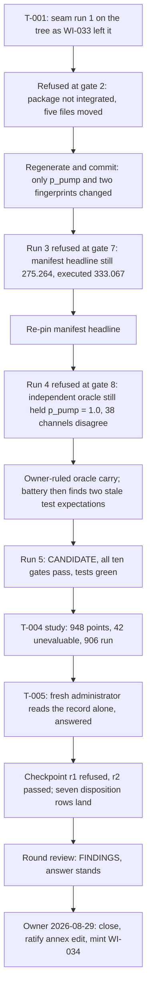

# Narrative: p-pump-fence

This is the human-facing engineering story of the goal. It summarizes cited records; it is not evidence, state, or a decision record. If this account and a cited source disagree, the source wins.

- **Goal status:** Closed by owner ruling after one round. This is an ordinary close, not a redirect: the owner closed on the review's recommendation, ratified one unscoped edit, and routed the single follow-up item to the modeling backlog as WI-034 rather than opening a second round.
- **Goal closed:** 2026-08-29 by the close entry's date, at approximately 03:11 UTC on 2026-08-30 (`5d740688`; Git commit-time proxy). The entry carries a date but no time. Date and disposition come from [the owner ruling](../orchestration/goals/p-pump-fence/trail.md#goal-close--2026-08-29).
- **Narrative cutoff:** Clean sources at base commit `f690b0cda619cc74994d12dbf9782d4833f69492`, generated 2026-09-04 at 22:35 UTC. The goal files, the study record, and every cited native record were clean in Git at that commit.
- **Review status:** Mixed. A fresh administrator read the study record alone and recomputed every headline number. The reading and dispositions passed a fresh checkpoint on the second submission. A fresh round review recomputed the study from its points file and returned `FINDINGS` with five corrections, none touching the answer. The owner's rulings were not reviewed. The 130 and 150 MW band figures are oracle-side, not package evidence, and are labeled where they appear.

## At a glance

- **The question:** With the pumping power re-based to 195 MW, where does the recirculating-power fence (`recirc_ok`) move, and what happens to LCOE? Agent-drafted wording the owner adopted verbatim. Source: [goal.md § Question](../orchestration/goals/p-pump-fence/goal.md#question).
- **Getting a pin took five integration runs:** the seam refused four times, each on a different hand-maintained copy of the old 1.0 MW package's outputs, before certifying a candidate. Source: [trail, T-002 and T-003 returns](../orchestration/goals/p-pump-fence/trail.md#t-003-return--2026-08-29).
- **The fence changed shape, not just position:** 32 violating points in a small-machine corner became 184 points in a diagonal band reaching a = 1.70 m, and at a = 0.80 every radius in the window violates. Source: [record.md § 6](../../exploration/stellarator_e2e/studies/20260829-p-pump-fence/record.md).
- **LCOE at the baseline point rose 21.0 %,** from 275.264 to 333.067 $/MWh, with all six verdicts still satisfied there. Source: [record.md § 3](../../exploration/stellarator_e2e/studies/20260829-p-pump-fence/record.md).
- **The decision:** On 2026-08-29 the owner closed the goal, ratified the unscoped annex edit, and minted WI-034 for the land-term guard with no second round. Source: [trail § Goal close](../orchestration/goals/p-pump-fence/trail.md#goal-close--2026-08-29).
- **What stays open:** where the fence ends in R at small minor radius, because it runs past the window's edge. No constrained optimum is claimed.

## Starting point and motivation

### The predecessor goal answered the basis and left the package run owed

Goal `p-pump-basis` closed on 2026-08-28 with the value re-based to 195 MW as a held input. Its final disposition row ended by saying that where the fence moves and what LCOE does still needed a package run. This goal is that run. Source: [goal.md § Consumer](../orchestration/goals/p-pump-fence/goal.md#consumer), citing [DISCOVERY_LOG.md](../../exploration/stellarator_e2e/studies/DISCOVERY_LOG.md) row 33.

### A hand estimate could not answer the LCOE half

The predecessor's learning L-003 established that thermal power reaches nine cost accounts directly, so pumping power moves capital cost as well as net power. The recirculating fraction can be rebuilt by hand from a committed record. LCOE cannot. Source: [p-pump-basis learnings.md L-003](../orchestration/goals/p-pump-basis/learnings.md).

### The model and every committed package disagreed by design

WI-033 landed 195 MW in the model on 2026-08-28 and left package regeneration out of scope. Its record says the model intentionally diverges from every committed package, and that the integration script refusing a stale package is the designed detection. Source: [WI-033 verification record](../completed/20260828_WI-033_p-pump-rebase/verification_record.md).

### What "answered" meant

A committed, verified study on the regenerated, pinned package that locates the fence and quantifies the LCOE shift at the baseline point, against the 1.0 MW record at its own pin. An adverse or inconclusive reading counts. A trail-only answer does not. Source: [goal.md § Answered when](../orchestration/goals/p-pump-fence/goal.md#answered-when).

The cross-pin comparison is legitimate only if the model delta between the two pins is known, audited, and single. If regeneration carried any other semantic change, the round closes on that. Source: [goal.md § Invariants](../orchestration/goals/p-pump-fence/goal.md#invariants).

### The lesson carried in

The predecessor's review had found that its strategy declared a study its own gates put out of reach. This goal's strategy checked reachability first: no model increment, the pin from the seam, the framing gate sequenced before any point runs. Source: [trail, Strategy revision](../orchestration/goals/p-pump-fence/trail.md#strategy-revision--2026-08-29).

## Story in one picture

The diagram shows the order in which the integration seam surfaced stale copies of the old package, and how the study, checkpoint, review, and ruling followed. Sources: [T-001](../orchestration/goals/p-pump-fence/trail.md#t-001-return--2026-08-29), [T-002](../orchestration/goals/p-pump-fence/trail.md#t-002-return--2026-08-29), [T-003](../orchestration/goals/p-pump-fence/trail.md#t-003-return--2026-08-29), [Round 1 result](../orchestration/goals/p-pump-fence/trail.md#round-1-result--2026-08-29), and [Goal close](../orchestration/goals/p-pump-fence/trail.md#goal-close--2026-08-29).

| At the baseline point (R 12.7 m, a 1.3 m) | 1.0 MW record | 195 MW study | Shift |
|---|---|---|---|
| LCOE ($/MWh) | 275.264 | 333.067 | +21.0 % |
| Net electric power (MW) | 915.081 | 752.413 | −162.7 |
| Recirculating fraction | 0.151 | 0.323 | +0.171 |
| Verdicts satisfied | 6 of 6 | 6 of 6 | none flip |

The table compares the two committed records at the same geometry, each at its own pin. Source: [record.md § 3](../../exploration/stellarator_e2e/studies/20260829-p-pump-fence/record.md), quoting the [1.0 MW record](../../exploration/stellarator_e2e/studies/20260821-power-cycle-ab/record.md); the 1.0 MW attribution is corrected in the [addendum](../../exploration/stellarator_e2e/studies/20260829-p-pump-fence/ADDENDUM-2026-08-29-artifacts.md) and [review finding 3](../orchestration/goals/p-pump-fence/trail.md#round-1-review--2026-08-29).

## Research learnings

### L-001: a model change reaches the package, but hand-maintained copies of its outputs are invisible to the model layer

Five artifacts carried a stale pre-WI-033 value, each repaired in its own commit: the manifest's headline, the independent oracle's held pumping power, a nine-anchor gate in a run script, a pinned LCOE in a test, and a literal in the studies annex. Four mechanisms found them, one class at a time.

The fifth was found only because the study executor read the annex for another purpose. Source: [learnings.md L-001](../orchestration/goals/p-pump-fence/learnings.md).

### L-002: an inherited window buys comparability and can silently cost containment

Adopting the comparand's grid is what makes the fence positions subtractable. It also carried a frame built for a 1.0 MW machine to a 195 MW one, where it no longer holds the fence. Adopting a window is a decision that owes a re-check. Source: [learnings.md L-002](../orchestration/goals/p-pump-fence/learnings.md).

### L-003: the model's unevaluable region now overlaps the window studies sweep

At this pin 42 of 948 proposed points cannot be evaluated: net power goes negative and a land-cost term takes the square root of it. Excluding them gives the net-power verdict a clean sheet across the other 906 that it did not earn. The record discloses this in its table but not in its finding text. Source: [learnings.md L-003](../orchestration/goals/p-pump-fence/learnings.md).

### L-004: a record can be arithmetically perfect and still fail its own contract

Every headline number recomputed from committed artifacts, twice. A fresh administrator still found three numbers in the prose that no artifact held. The review then found the same shape three more times, twice inside the documents written to correct the first ones. Nothing checks the numbers that are absent, and nothing checks the corrections. Source: [learnings.md L-004](../orchestration/goals/p-pump-fence/learnings.md).

## Model changes

### No model change; the package and five of its mirrors changed

The strategy declared no model increment, and none landed. Regeneration changed the package by exactly the audited delta: the pumping value in the inputs file and the schema, two provenance line numbers in one module, and the two contract fingerprints. Source: [T-002 return](../orchestration/goals/p-pump-fence/trail.md#t-002-return--2026-08-29) and [Round 1 review](../orchestration/goals/p-pump-fence/trail.md#round-1-review--2026-08-29).

The five stale mirrors named in L-001 were each repaired to the value the regenerated package produced, never patched by hand to match. The oracle repair overrode a written prohibition on editing the independent oracle, under an owner ruling that independence lives in its arithmetic and not in its parameterization. Source: [T-003 scope](../orchestration/goals/p-pump-fence/trail.md#t-003-scope).

### The single-delta condition was measured, not inferred

The review checked directly that the package was byte-unchanged between the comparand's pin and the regeneration, and that the regeneration commit touched nothing beyond the five files above. That measurement, plus WI-033's audit of the model side, is what licenses attributing the whole shift to pumping power. Source: [Round 1 review](../orchestration/goals/p-pump-fence/trail.md#round-1-review--2026-08-29).

### One edit had no task scope

The annex's baseline-pin literal was re-pinned in a one-line commit that no task scope authorized. The review recorded it as an authorization gap, and the owner ratified the edit at close. Source: [Round 1 review, finding 1](../orchestration/goals/p-pump-fence/trail.md#round-1-review--2026-08-29) and [Goal close](../orchestration/goals/p-pump-fence/trail.md#goal-close--2026-08-29).

## Study results

### The fence changed character

| Minor radius a (m) | 195 MW: violated up to R (m) | Violating points |
|---|---|---|
| 0.80 | 20.0, the window's edge | 22 |
| 1.00 | 12.5 | 14 |
| 1.20 | 9.0 | 10 |
| 1.40 | 6.5 | 6 |
| 1.60 | 5.0 | 3 |
| 1.70 | 4.0 | 1 |
| above 1.70 | none | 0 |

The table shows the largest violating major radius at selected minor radii, from the full nineteen-row table in the record. At 1.0 MW the comparand had 32 violating points, bounded at R ≤ 8.0 m for a = 0.80 and gone above a = 1.10 m. Source: [record.md § 6](../../exploration/stellarator_e2e/studies/20260829-p-pump-fence/record.md), recomputed by the [synthesis](../../exploration/stellarator_e2e/studies/20260829-p-pump-fence/synthesis.md) and the review.

At a = 0.80 the window no longer contains the fence, so the study cannot say where it ends in R there. The record refuses in three places to report the window edge as a fence position. Source: [record.md § 17](../../exploration/stellarator_e2e/studies/20260829-p-pump-fence/record.md).

### Feasibility fell and the best point sits on the edge

Feasible points fell from 59.4 % of the comparand's grid to 40.8 % of the evaluated points here. The best feasible LCOE is 225.725 $/MWh at (R 20.0, a 1.65), on the window's R edge with the objective still falling, so no optimum is claimed. One point now violates both the recirculating and wall-load fences. Source: [record.md §§ 3–4](../../exploration/stellarator_e2e/studies/20260829-p-pump-fence/record.md).

### The result holds across the sourced band

| Held pumping power (MW) | Fence reach in R at a = 0.80 (m) | Baseline LCOE ($/MWh) | Shift vs 1.0 MW |
|---|---|---|---|
| 130 | 16.0 | 311.122 | +13.0 % |
| 150 | 17.0 | 317.554 | +15.4 % |
| 195 | 20.0 | 333.067 | +21.0 % |

These rows are oracle-side re-evaluations, not package runs. They were stated in the record without an artifact and deposited afterwards by the addendum. Source: [near_fence_band.csv](../../exploration/stellarator_e2e/studies/20260829-p-pump-fence/addendum/near_fence_band.csv) via the [addendum](../../exploration/stellarator_e2e/studies/20260829-p-pump-fence/ADDENDUM-2026-08-29-artifacts.md).

### Verification and the administrator's reading

The package verified against the independent oracle at a worst channel deviation of 6.35e-16 with no verdict mismatches. The fresh administrator reached the class "answered" from the record alone, and listed fifteen facts the record does not support. Source: [verification_summary.json](../../exploration/stellarator_e2e/studies/20260829-p-pump-fence/results/verification_summary.json) and [synthesis.md](../../exploration/stellarator_e2e/studies/20260829-p-pump-fence/synthesis.md).

## Outcome and follow-on issues

### Outcome: the owner's three-word ruling

- **Close.** The answer contract is met on all four of its terms: a seam-certified pin, both halves answered, the comparand quoted at its own pin, and a reading that is neither adverse nor inconclusive. Source: [trail § Goal close](../orchestration/goals/p-pump-fence/trail.md#goal-close--2026-08-29).
- **Ratify.** The unscoped annex re-pin stands, with the review's finding kept as the record of the gap.
- **Route.** No round 2. The land-term guard, one defect sighted in two studies, is minted as WI-034 under the MFE Cost Modeling epic. At this cutoff it sits in the backlog with no work started. Source: [work/BACKLOG.md](../BACKLOG.md).

### What the review flagged

- **An unscoped side effect.** The annex edit had no covering task scope. Correct on the facts, recorded as a gap, ratified by the owner.
- **A stale sighting.** The record's third finding described the annex literal as stale when the commit fixing it already existed. The disposition row states the true state.
- **An over-correction.** The addendum called three 1.0 MW cells over-precise and left one unsourced. All four trace at full precision to committed artifacts. The headline was never affected.
- **Two over-claims in prose.** The addendum said the record named four knife-edge points where it named two. The round result said all five seam runs skipped a coverage check, when only the three that reached that gate did. Source for all four: [Round 1 review](../orchestration/goals/p-pump-fence/trail.md#round-1-review--2026-08-29).

### Follow-on issues

- **The fence's extent in R at a ≤ 0.85 is unmeasured.** It needs a wider window, which costs the grid-for-grid subtractability this round's window bought. Deliberately not chased. Source: [DISCOVERY_LOG.md](../../exploration/stellarator_e2e/studies/DISCOVERY_LOG.md) row under `20260829-p-pump-fence#2`.
- **WI-034 is minted and unstarted.** The guard should make a net-negative point return a violated verdict instead of an execution failure.
- **Nothing enumerates the stale-mirror class.** The seam and the test battery find what they were built to find. The fifth instance was found by a reader. Source: [learnings.md L-001](../orchestration/goals/p-pump-fence/learnings.md).
- **Two seam checks still have no live evidence.** The research seam's request-and-return bookkeeper has never run end to end, and the manifest gate's read-set coverage check was skipped on every run that reached it. Source: [Round 1 result](../orchestration/goals/p-pump-fence/trail.md#round-1-result--2026-08-29), as corrected by review finding 5.
- **Constraints for any future round.** Every side effect outside the goal directory needs a scope naming it. A scope's authorized list must cover what its done-condition implies. A study that repairs an artifact it also sights must say so in the sighting. Source: [Round 1 review](../orchestration/goals/p-pump-fence/trail.md#round-1-review--2026-08-29).
- **The window lesson was reused.** Later studies under other goals cite this goal's second finding as the precedent for declaring a frame defect rather than minting one. Outside this goal's evidence. Source: [DISCOVERY_LOG.md](../../exploration/stellarator_e2e/studies/DISCOVERY_LOG.md) rows under `20260903-priced-levers#5` and `20260903-wall-and-heating#6`.

## Evidence and visual index

Goal files:

- [goal.md](../orchestration/goals/p-pump-fence/goal.md), the grounded charter: question, invariants, grounding evidence, reserved gates, close rule.
- [trail.md](../orchestration/goals/p-pump-fence/trail.md), the round record: grounding check, strategy, five task returns, two checkpoint submissions, round result, review, and owner ruling.
- [learnings.md](../orchestration/goals/p-pump-fence/learnings.md), L-001 through L-004 as accepted by the review.
- [Seam evidence](../orchestration/goals/p-pump-fence/evidence/integration-run-5/integration_return.json), five integration runs; run 1 is the designed refusal and run 5 the candidate.

Native records the story rests on:

- [20260829-p-pump-fence record.md](../../exploration/stellarator_e2e/studies/20260829-p-pump-fence/record.md), with [points.csv](../../exploration/stellarator_e2e/studies/20260829-p-pump-fence/results/points.csv), [excluded_points.csv](../../exploration/stellarator_e2e/studies/20260829-p-pump-fence/results/excluded_points.csv), and [snapshot.json](../../exploration/stellarator_e2e/studies/20260829-p-pump-fence/snapshot.json).
- [synthesis.md](../../exploration/stellarator_e2e/studies/20260829-p-pump-fence/synthesis.md), the fresh administrator's reading, and the [addendum](../../exploration/stellarator_e2e/studies/20260829-p-pump-fence/ADDENDUM-2026-08-29-artifacts.md) with its three artifacts.
- [20260821-power-cycle-ab record.md](../../exploration/stellarator_e2e/studies/20260821-power-cycle-ab/record.md), the 1.0 MW comparand at its own pin.
- [DISCOVERY_LOG.md](../../exploration/stellarator_e2e/studies/DISCOVERY_LOG.md), seven disposition rows dated 2026-08-29 and the two owner-ruled rows after close.
- [WI-033 verification record](../completed/20260828_WI-033_p-pump-rebase/verification_record.md), the audited model change this goal integrated.
- [p-pump-basis trail](../orchestration/goals/p-pump-basis/trail.md) and [learnings](../orchestration/goals/p-pump-basis/learnings.md), the predecessor's rulings and L-003.
- [ADR-0009](../../.project/adr/0009-integration-is-a-fixed-point-proof.md) and the [seam operator guide](../../docs/integration_seam_operator_guide.md), the pattern the integration runs followed.
- [ANNEX.md](../../exploration/stellarator_e2e/studies/ANNEX.md) and [verify_stellaris.py](../../exploration/stellarator_e2e/verify_stellaris.py), two of the five repaired mirrors.
- [run-study runbook](../../.claude/skills/run-study/runbook.md), where the window re-check and the record-contract findings are routed.

Visuals in this narrative:

- The flowchart in Story in one picture: the seam arc, the study, and the ruling.
- The baseline table in Story in one picture: LCOE, net power, and recirculating fraction before and after.
- The fence table in Study results: violating reach by minor radius at 195 MW.
- The band table in Study results: oracle-side robustness across 130 to 195 MW.
