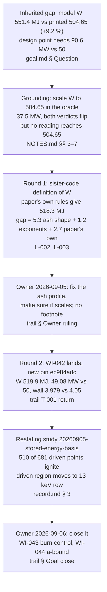

# Narrative: stored-energy-basis

This is the human-facing engineering story of the goal. It summarizes cited records; it is not evidence, state, or a decision record. If this account and a cited source disagree, the source wins.

- **Goal status:** Closed by owner ruling on § Answered when after two rounds of a six-round limit. An ordinary close, not a redirect: the owner said "close it" on the round-2 review's recommendation, closed and archived the model item, ratified one amendment, declined the author query, and carried three follow-ons. Source: [trail § Goal close](../orchestration/goals/stored-energy-basis/trail.md#goal-close--2026-09-06).
- **Goal closed:** 2026-09-06 by the close entry's date, at approximately 20:26 UTC (`ed40db86`; Git commit-time proxy). The entry carries a date but no time. Date and disposition come from [trail § Goal close](../orchestration/goals/stored-energy-basis/trail.md#goal-close--2026-09-06).
- **Narrative cutoff:** Clean sources at base commit `ed40db86eef52ba1921cfd11319ae7a57a278078`, generated 2026-09-06 at 20:48 UTC. The goal files, the study record, the discovery log, the archived WI-042 item, the backlog and the validation matrix were all clean in Git at that commit.
- **Review status:** Mixed. The grounding counterfactual is oracle-side arithmetic, recounted by the round-1 reviewer. Both rounds got a fresh non-author review returning `FINDINGS`, precision corrections only, none reopening a task. The study record passed a pre-execution critique (MAJOR, all eleven findings accepted before any point ran), a fresh administrator's recount, and a checkpoint on its second submission. The owner's rulings were not reviewed.

## At a glance

- **The question:** does the pinned design point's failed sustainment check rest on how the model computes stored thermal energy, and is the paper's printed 504.65 MJ the right target? Agent wording; the owner ratified grounding on 2026-09-05 without separately reviewing it. Source: [goal.md § Question](../orchestration/goals/stored-energy-basis/goal.md#question).
- **The premise broke at grounding:** no reading of the paper's own plotted profiles and printed peaks reaches 504.65 MJ, and the paper's printed beta implies 567 MJ. The printed value is not a target. Source: [NOTES.md § 7](../orchestration/goals/stored-energy-basis/evidence/w_counterfactual/NOTES.md), [L-002](../orchestration/goals/stored-energy-basis/learnings.md).
- **The real gap was the helium-ash profile shape.** The model gave the ash the fuel's flat shape; the paper's own rule peaks it in the core. That is about five of the nine points. Source: [L-003](../orchestration/goals/stored-energy-basis/learnings.md).
- **The fix, WI-042, changed nothing else and tuned nothing.** Stored energy fell from 551.4 to 519.9 MJ, required heating from 90.6 to 49.1 MW against a 50 MW limit, and the wall load came under its limit. Source: [trail, round 2 T-001 return](../orchestration/goals/stored-energy-basis/trail.md#t-001-return--2026-09-05-round-2).
- **The demo statement:** the machine as designed is satisfied on every fence, on the boundary. "Needs 90 MW" is retired. "Is feasible" cannot be decided from the paper. Source: [L-004](../orchestration/goals/stored-energy-basis/learnings.md).
- **The surprise:** across the wider design window, most points that were "driven" now ignite, which the model cannot yet handle. Two backlog items carry that. Source: [L-005](../orchestration/goals/stored-energy-basis/learnings.md), [trail § Goal close](../orchestration/goals/stored-energy-basis/trail.md#goal-close--2026-09-06) ruling 7.

## Starting point and motivation

### An inherited 9 % gap that nobody owned

The model integrates assumed power-law density and temperature profiles to get the plasma's stored thermal energy (W). It found 551.4 MJ where the Stellaris paper prints 504.65, a +9.2 % gap, with every other balance term within 4 % of the paper. Source: [goal.md § Question](../orchestration/goals/stored-energy-basis/goal.md#question).

That gap mattered because conducted loss in the model's confinement closure rises steeply with W. At the model's W the design point needed 90.6 MW of coupled heating against 50 MW installed, so its sustainment check failed. Two earlier goals carried this as "not a defect" on an agent-written rule that W is never tuned. Source: [goal.md § Question](../orchestration/goals/stored-energy-basis/goal.md#question).

### The grounding diagnostic flipped the verdict and undercut the target

Before the goal was ratified, the agent scaled W to the printed value inside an in-memory copy of the oracle. The required heating fell to 37.5 MW and both baseline violations flipped to satisfied. But the same arithmetic showed the printed 504.65 MJ is the odd one out among the paper's own numbers. Source: [trail § Grounding](../orchestration/goals/stored-energy-basis/trail.md#grounding--2026-09-04).

The owner ratified grounding on 2026-09-05 with the words "agreed with grounding the goal". Source: [goal.md § Amendment 2026-09-05](../orchestration/goals/stored-energy-basis/goal.md#amendment-2026-09-05--amends--status).

## Story in one picture

The chain below shows how a question about a printed number became a sourced model change, then a new open question. Every arrow is a recorded step in the trail; each box names its record.

The table below puts the design point on each stored-energy basis the goal evaluated. The first two scaled rows are oracle-side diagnostics, not package evidence; the last row is the pinned package. Source: [L-001](../orchestration/goals/stored-energy-basis/learnings.md), [L-004](../orchestration/goals/stored-energy-basis/learnings.md), [trail, round 2 T-001 return](../orchestration/goals/stored-energy-basis/trail.md#t-001-return--2026-09-05-round-2).

| Basis for W | W (MJ) | Heating required (MW, limit 50) | Sustainment | Wall peak (MW/m², limit 4.05) | LCOE ($/MWh) |
|---|---|---|---|---|---|
| Model's old profile family, pin `c1b0f0d1` | 551.4 | 90.6 | violated | 4.088, violated | 313.513 |
| Scaled to printed 504.65 (oracle-side) | 501.7 | 37.5 | satisfied | 3.861, satisfied | 332.6 |
| Scaled to sourced 518.3 (oracle-side) | 516.2 | 51.4 | violated by 1.4 | 3.930, satisfied | not read |
| WI-042 ash rule, pin `ec984adc` | 519.9 | 49.08 | satisfied by 0.92 | 3.979, satisfied | 322.318 |

## Research learnings

### No admissible source reproduces the printed 504.65 MJ

Round 1 sent one research request through the research seam. It registered the same author's systems-code papers (Lion 2021 and Lion 2023), whose appendix the Stellaris paper reproduces almost verbatim. Their definition of W, applied with the Stellaris paper's own profile rules on its printed peaks, gives 518.3 MJ, 2.7 % above the printed value. Source: [L-002](../orchestration/goals/stored-energy-basis/learnings.md).

The same evaluation reproduces the printed fusion power, peak density and average density. The printed beta of 2.76 % implies 567 MJ at the only field the paper names. The two printed numbers agree only at a field the paper does not state. Source: [L-002](../orchestration/goals/stored-energy-basis/learnings.md).

### The attribution, in points of the printed value

| Component of the +9.2 % | Points | What it is |
|---|---|---|
| Helium-ash profile shape | 5.3 | Model gave the ash the fuel's exponent; the paper's rule peaks it (effective exponent about 4.1) |
| Profile exponents | 1.2 | Model's digitized 1.19 / 0.33 against the paper's stated 1.2 / 0.35 |
| The paper's own | 2.7 | Sourced rules give 518.3, not 504.65; not closable from any admissible source |

Source: [L-003](../orchestration/goals/stored-energy-basis/learnings.md) § Scope. The model's own exponents were confirmed as a fair read of the paper's figure, so this was never a digitization slip.

### The author query was declined

The remaining 2.7 % and the beta row could only be settled by asking the paper's author. On 2026-09-06 the owner ruled "decline": the model's W at the rule sits above both of the paper's numbers with the verdict satisfied throughout, so an answer would sharpen the paper, not the model. Source: [trail § Goal close](../orchestration/goals/stored-energy-basis/trail.md#goal-close--2026-09-06) ruling 6.

## Model changes

### The owner chose the fix over the footnote

Round 1 offered two options: keep the profile family and footnote the disclosed over-count, or mint a model item for the ash shape. The owner ruled on 2026-09-05: "we should fix the ash profile (and make sure this scales up for larger stellarators). and I don't want to add the footnote." Source: [trail § Owner ruling](../orchestration/goals/stored-energy-basis/trail.md#owner-ruling--2026-09-05---answered-when-c).

### WI-042: the ash follows the paper's rule, computed everywhere

The item landed in round 2 through the modeling PM and is archived at [work/completed/20260906_WI-042](../completed/20260906_WI-042_sourced-helium-ash-profile/spec.md). What changed, per the [T-001 return](../orchestration/goals/stored-energy-basis/trail.md#t-001-return--2026-09-05-round-2):

- **Ash profile from the rule.** The helium-ash profile is the fusion-rate shape scaled to the converged peak (Stellaris Eq. A.5 applied pointwise), not a bound exponent.
- **Electrons by quasi-neutrality.** The electron profile is the ions' charge, pointwise; the point-A electron exponent 0.596 is retired as an input. The derived value at the baseline is 0.5953.
- **One pressure integral.** W and beta read the same volume-averaged pressure, so their agreement holds by construction.
- **The shape scales.** The ash exponent is a function of ion temperature alone: 4.73 at 10 keV, 4.05 at 14.63, 3.46 at 20 keV. Halving the confinement-time ratio moves the ash amount, not the shape. Source: SV-056 in [VALIDATION_MATRIX.md](../../modeling_project/VALIDATION_MATRIX.md).

### What the design point reads at the new pin

| Quantity | Old family | WI-042 rule | Change |
|---|---|---|---|
| Stored energy W | 551.444 MJ | 519.914 MJ | −5.7 % |
| Energy confinement time | 1.450 s | 1.557 s | +7.4 % |
| Fusion power | 2725.4 MW | 2652.6 MW | −2.7 % |
| Required coupled heating (limit 50) | 90.605 MW | 49.080 MW | verdict flips |
| Wall peak (limit 4.05) | 4.088 MW/m² | 3.979 MW/m² | verdict flips |
| LCOE | 313.513 $/MWh | 322.318 $/MWh | +2.8 % |

Source: [T-001 return](../orchestration/goals/stored-energy-basis/trail.md#t-001-return--2026-09-05-round-2). The independent oracle reproduces every sustainment channel bit-exact (SV-053 to SV-056 passing). The integration seam promoted the pin on its first run. Source: [trail, round 2 result](../orchestration/goals/stored-energy-basis/trail.md#round-2-result--2026-09-06).

## Study results

### The restating study re-executed the whole committed window

Study `20260905-stored-energy-basis` re-ran the earlier `20260904-wall-and-heating` window at the new pin, point by point, beside the committed record and the two constant-scale counterfactuals. A pre-execution critique caught that the old window's 13 keV floor had been set by the fence WI-042 relieved, so those rows were restored before any point ran. Source: [record.md § 14](../../exploration/stellarator_e2e/studies/20260905-stored-energy-basis/record.md).

### Verdict flips over the 6,283 points executed in both records

| Constraint | Committed → rule | Direction |
|---|---|---|
| Sustainment | 964 flips | violated → satisfied, none back |
| Wall load | 192 flips | violated → satisfied |
| Beta | 156 flips | violated → satisfied |
| Recirculating power | 111 flips | satisfied → violated |

Source: [record.md § 4](../../exploration/stellarator_e2e/studies/20260905-stored-energy-basis/record.md).

### The driven set mostly ignited, and moved

Of the committed 681 driven points, 510 now read a negative heating requirement and pass every other fence, meaning they ignite. Only 146 stay driven; 25 become violated. The model's one-sided sustainment fence passes ignited points, so every count that does not say "driven" is decided by a burn-control gap the model does not have. Source: [L-005](../orchestration/goals/stored-energy-basis/learnings.md).

| Reading at 100 MW wall-plug | Committed (old family) | WI-042 rule |
|---|---|---|
| Driven points over the committed window | 257 | 131 |
| Driven points including restored 13 keV rows | not executed | 306 (175 on the 13 keV row) |
| Cheapest driven LCOE | 212.460 $/MWh | 202.192 $/MWh at R 15.7, a 2.2, 13 MA, 13 keV |
| Driven points at the design geometry (R 12.7, a 1.3) | 0 | 1, the pinned baseline itself, 322.318 |

Source: [record.md § 3](../../exploration/stellarator_e2e/studies/20260905-stored-energy-basis/record.md). The cheapest driven point sits at the window's minor-radius edge, which nothing bounds or prices. Its temperature band is about one keV wide. Source: [L-005](../orchestration/goals/stored-energy-basis/learnings.md), [L-008](../orchestration/goals/stored-energy-basis/learnings.md).

### The constant-scale counterfactuals predicted signs, not locations

The W correction the rule makes is not a constant: 0.79 to 1.02 of the committed W, tracking the ash fraction almost perfectly (rank correlation −0.998). At the design point the rule's heating requirement landed between the two scaled predictions; elsewhere it fell below both at 3,456 points and above both at 2,316. Source: [L-006](../orchestration/goals/stored-energy-basis/learnings.md), [L-007](../orchestration/goals/stored-energy-basis/learnings.md).

## Outcome and follow-on issues

### The owner's close rulings, 2026-09-06

All eight rulings are recorded verbatim in [trail § Goal close](../orchestration/goals/stored-energy-basis/trail.md#goal-close--2026-09-06).

1. **Closed on § Answered when** ("close it"). Parts (a), (b) and (c) met; round 2 of 6.
2. **WI-042 closed and archived** ("yes, close and archive").
3. **Amendment (c) ratified as written**: the Package invariant binds the goal's own pen; writes through the modeling PM inside a minted item are that workflow's.
4. **Five native sites carrying the older "inside the 2.7 % residual" reasoning** get dated corrections in L-004's form; the model's own doc comment waits for the next model item.
5. **Two closed goals and two learnings** get added, dated update notes beneath their original lines, nothing overwritten.
6. **The author query declined.**
7. **Three follow-ons carried**: WI-043 (burn-control lever or second sustainment inequality, P1) and WI-044 (minor-radius bound and wall-peak calibration re-anchoring, P2) minted in [BACKLOG.md](../BACKLOG.md); the transport-facts research request stays in the discovery log.
8. **The study runbook gains a step-7 sentence**: a restated window is re-scanned at the new package before any point runs.

### What the answer does and does not claim

- **Claimed:** the printed 504.65 MJ is not a target; the model's gap was the ash shape and it is gone; the design point is satisfied on every fence at the paper's own ash rule. Source: [trail § Goal close](../orchestration/goals/stored-energy-basis/trail.md#goal-close--2026-09-06), closing paragraph.
- **Not claimed:** that the machine is feasible. The 0.92 MW sustainment margin is about 0.18 % of W, and the source's own numbers disagree about its stored energy by more than that in both directions. Source: [L-004](../orchestration/goals/stored-energy-basis/learnings.md).
- **Not claimed:** any per-point location from the constant-scale counterfactuals, or any LCOE optimum resting on ignited points. Source: [L-005](../orchestration/goals/stored-energy-basis/learnings.md), [L-006](../orchestration/goals/stored-energy-basis/learnings.md).

### Limits that travel with every number

- **The coupling efficiency is held at 1.00.** At 0.98 the design point's sustainment check fails again. Source: [L-004](../orchestration/goals/stored-energy-basis/learnings.md).
- **The ash amount still rests on point-A facts** (the confinement-time ratio, helium suppression, rotational transform). Only the shape is computed from the rule everywhere. Source: [L-007](../orchestration/goals/stored-energy-basis/learnings.md).
- **The one-sided sustainment fence** admits ignited points as "feasible"; WI-043 exists to fix that. Source: [L-005](../orchestration/goals/stored-energy-basis/learnings.md).
- **No point below 13 keV was executed;** the driven band's lower edge is bracketed, not measured. Source: [L-008](../orchestration/goals/stored-energy-basis/learnings.md).
- **The round-2 reviewer read the paper's extraction, not its page images,** which were not pulled in the worktree. Source: [trail § Round 2 review](../orchestration/goals/stored-energy-basis/trail.md#round-2-review--2026-09-06).
- **A SysIDE licence lapse** seen in the reviewer's shell did not reproduce for the round agent; it stands as a watch item. Source: [trail § Stop 2026-09-06](../orchestration/goals/stored-energy-basis/trail.md#stop--2026-09-06).

## Evidence and visual index

| Record | What it carries |
|---|---|
| [goal.md](../orchestration/goals/stored-energy-basis/goal.md) | Question, answered-when, invariants, the four amendments including the close |
| [trail.md](../orchestration/goals/stored-energy-basis/trail.md) | Grounding, both rounds, both reviews, the 2026-09-05 owner ruling, the 2026-09-06 close |
| [learnings.md](../orchestration/goals/stored-energy-basis/learnings.md) | L-001 to L-008, appended in the reviewers' corrected forms |
| [evidence/w_counterfactual/NOTES.md](../orchestration/goals/stored-energy-basis/evidence/w_counterfactual/NOTES.md) | Grounding diagnostic: scaled-W counterfactuals and the attribution arithmetic |
| [evidence/round1_review.md](../orchestration/goals/stored-energy-basis/evidence/round1_review.md) | Round-1 fresh review, `FINDINGS`, six precision findings |
| [evidence/round2_review.md](../orchestration/goals/stored-energy-basis/evidence/round2_review.md) | Round-2 fresh review, `FINDINGS`, eight precision findings, close recommendation |
| [WI-042 spec](../completed/20260906_WI-042_sourced-helium-ash-profile/spec.md) | The archived model item; § Amendments carries the L-004 correction |
| [record.md](../../exploration/stellarator_e2e/studies/20260905-stored-energy-basis/record.md) | The restating study: constraint outcomes, driven counts, eight findings |
| [DISCOVERY_LOG.md](../../exploration/stellarator_e2e/studies/DISCOVERY_LOG.md) | Sighting, disposition and close rows for both windows' finding ids |
| [VALIDATION_MATRIX.md](../../modeling_project/VALIDATION_MATRIX.md) | SV-053 to SV-056; SV-042 amended |
| [BACKLOG.md](../BACKLOG.md) | WI-043 and WI-044 |

Visuals in this narrative: the causal-chain flowchart and the four-basis design-point table (Story in one picture); the attribution table (Research learnings); the before-and-after design-point table (Model changes); the verdict-flip and driven-set tables (Study results).
