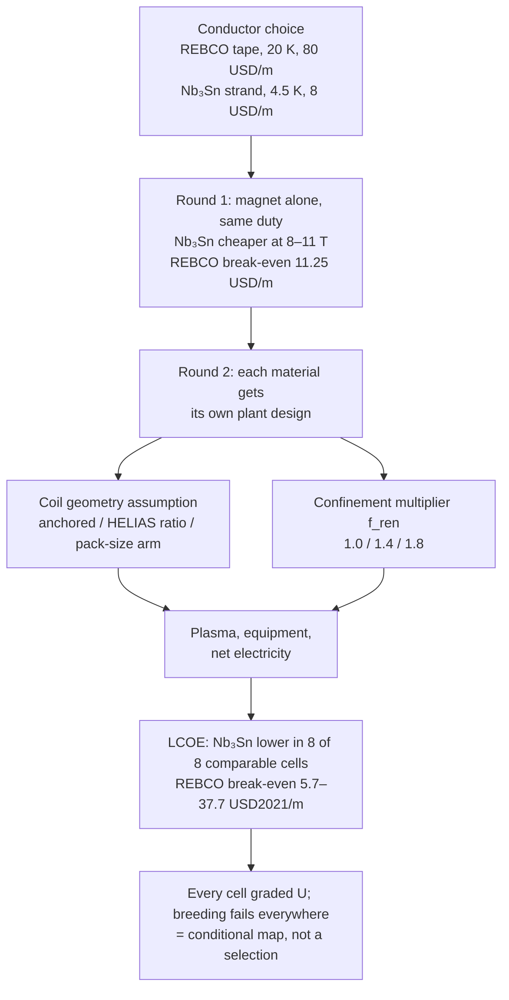
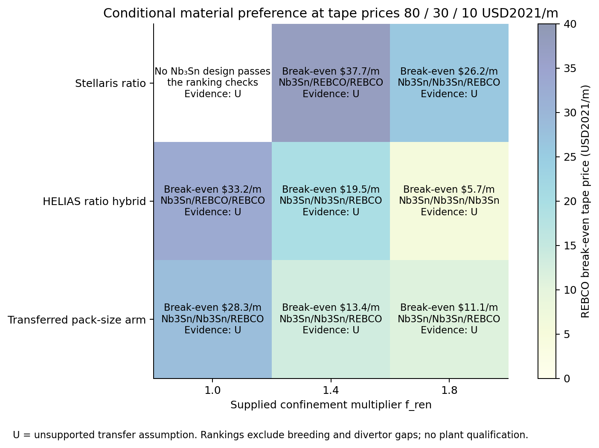
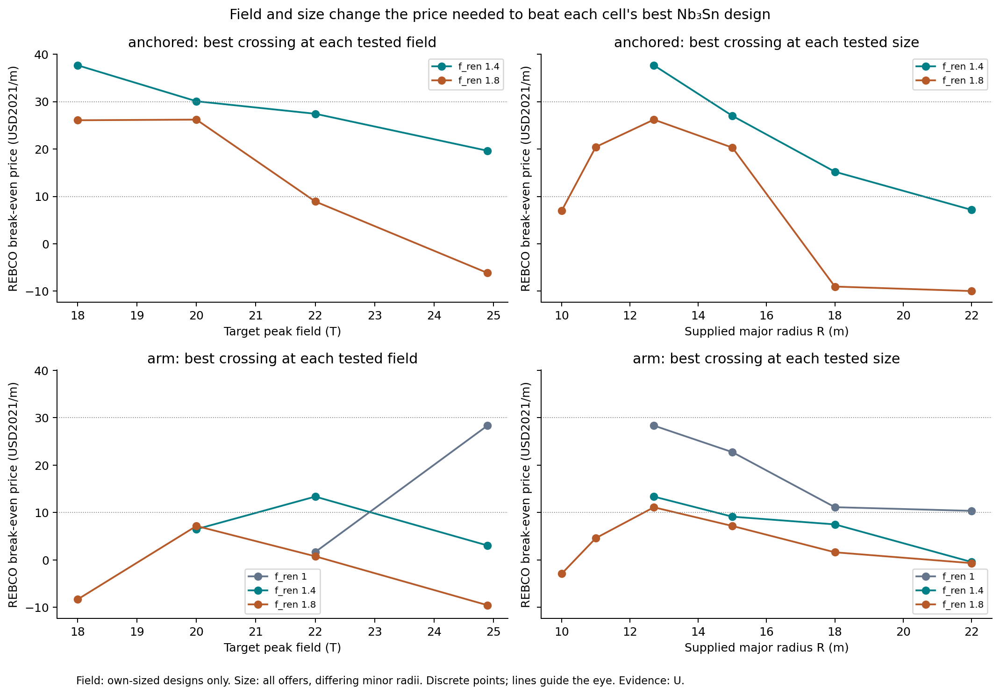
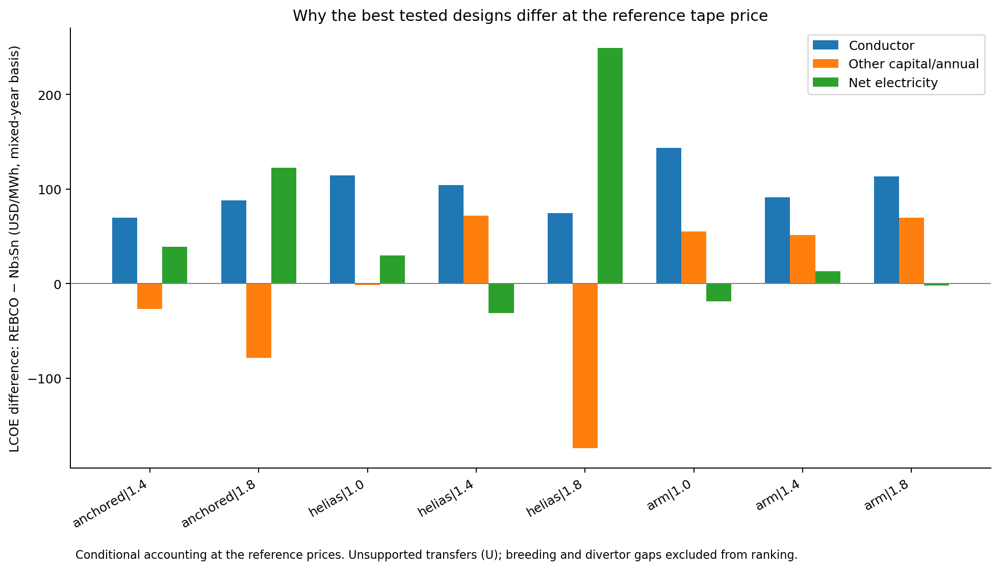

# Narrative: magnet-material-comparison

This note summarizes cited records for human readers. It is not evidence, goal state, or a decision record. If it disagrees with a cited source, the source wins.

- **Goal status:** Open; no owner close is recorded at this cutoff. Two rounds are complete and reviewed. The Round 2 review recommends owner closure, with physical plant qualification stated as unmet. [Round 2 review](../orchestration/goals/magnet-material-comparison/trail.md#round-2-review--2026-10-05)
- **Narrative cutoff:** Provisional working tree over `a58a0911cc072d64c90403995feef0db1c482188`; uncommitted source content was included and the exact source state may not be recoverable from Git. Generated 2026-10-06 13:09:22 UTC. Uncommitted inputs include `goal.md`, `trail.md`, `learnings.md`, `answer.md`, the Round 2 reporting README and dispositions, the untracked `evidence/pr-readiness/`, and the plant study's `DISCOVERY_LOG.md`.
- **Review status:** Mixed, by round. This narrative itself has not been independently reviewed.
  - Round 1: sources and contract independently checked; model checked by a separately written oracle; [final answer review](../orchestration/goals/magnet-material-comparison/evidence/final-review.md) rechecked its corrections, and the coordinator applied and recomputed its last numeric item. No separate round-level fresh reviewer was commissioned.
  - Round 2: [plant contract review](../orchestration/goals/magnet-material-comparison/evidence/plant-contract-review.md) released r2; [field-relation check](../orchestration/goals/magnet-material-comparison/evidence/check-field-relations.md) and [design review](../orchestration/goals/magnet-material-comparison/evidence/design-review-wi100.md) passed with corrections; [integration review](../orchestration/goals/magnet-material-comparison/evidence/pr-readiness/independent-review.md) passed after one accounting correction, then gave final round assurance.
  - The pre-PR branch gate was not run.

## At a glance

- **The question:** which superconductor makes cheaper fusion magnets? REBCO is a high-temperature tape run near 20 K; Nb₃Sn is a low-temperature wire run near 4.5 K. Round 1 compared the magnet alone; Round 2 compared the cost of electricity for a whole stellarator plant (LCOE, lifetime cost per MWh). [Goal](../orchestration/goals/magnet-material-comparison/goal.md)
- **Magnet alone, price decides:** at the reference 10 T duty and supplied winding offers, Nb₃Sn costs 48.5 and REBCO 286.1 M USD/yr. REBCO's break-even tape price is 11.25 USD/m for that case, against the study's 80 USD/m reference price. [Round 1 answer](../orchestration/goals/magnet-material-comparison/answer-round1.md)
- **Whole plant, Nb₃Sn still has lower modeled LCOE in all eight comparable cases at reference prices:** the REBCO tape price needed to reverse that ranges from 5.7 to 37.7 USD2021/m, depending on the confinement and coil-geometry assumptions. [Round 2 answer](../orchestration/goals/magnet-material-comparison/answer.md#the-assumption-map)
- **Higher field does not consistently make REBCO more competitive:** in one conditional design envelope, raising field from 18 T to 24.9 T lowers REBCO's break-even price from 37.66 to 19.63 USD/m. [Interactions](../orchestration/goals/magnet-material-comparison/answer.md#what-field-size-and-confinement-change)
- **The main limit:** the result is a conditional map, not a material selection. Every comparison rests on physics assumptions moved outside their source configurations, and no design passes tritium breeding. [Limits](../orchestration/goals/magnet-material-comparison/answer.md#checks-limits-and-next-evidence)

## Starting point and motivation

The owner wanted to know whether the model could support a credible material-choice study. Earlier evidence could not: a September sizing study used one REBCO conductor with automatic sizing, and an August REBCO/Nb₃Sn input swap predated current conductor physics. [Owner brief](../orchestration/goals/magnet-material-comparison/evidence/owner-brief.md), [goal grounding](../orchestration/goals/magnet-material-comparison/goal.md#grounding-evidence)

The model as found could not host the comparison. It evaluated REBCO only at exactly 20 K and 20–32 T. It had no Nb₃Sn law, no 4.5 K refrigeration basis, and no Nb₃Sn price. [Binding audit, T-001 return](../orchestration/goals/magnet-material-comparison/trail.md#t-001-return--2026-09-29)

### Round 2 asked whether REBCO's capability pays off at plant level

[OWNER-VERBATIM] “Can REBCO’s additional field or winding-space capability improve the plant enough to offset its higher magnet cost, measured in LCOE?” [Amendment 1](../orchestration/goals/magnet-material-comparison/goal.md#amendments)

The plant audit then found that an Nb₃Sn plant had no supported basis. With the Stellaris field geometry held, the study's supported Nb₃Sn conductor-law range puts the on-axis field at 4.34–4.70 T. There, beta, heating or plant size leave every sourced design's neighbourhood. [T-009 return](../orchestration/goals/magnet-material-comparison/trail.md#t-009-return--2026-09-30)

The owner did not pick one basis. [OWNER-VERBATIM] “Across explicit assumptions about confinement and coil geometry, when does each material give lower LCOE—and are those conditions supported by evidence?” [AGENT] The coordinator read this as a map over declared assumption axes, each cell labelled by its evidence. [Owner ruling](../orchestration/goals/magnet-material-comparison/trail.md#owner-ruling-on-the-t-009-gate--2026-09-30)

## Story in one picture

This diagram shows how the question moved from the magnet to the plant, and where the conclusion stops. Each box states the recorded result at that link of the chain.

Sources: [Round 1 answer](../orchestration/goals/magnet-material-comparison/answer-round1.md#results-at-reference-offers); [Round 2 answer](../orchestration/goals/magnet-material-comparison/answer.md#the-assumption-map); [Round 2 result](../orchestration/goals/magnet-material-comparison/trail.md#round-2-result--2026-10-05). "U" means an unsupported transfer or supplied assumption. The ninth cell has no Nb₃Sn comparator.

## Research learnings

### Sources support a magnet comparison at roughly 8–12 T

- **Nb₃Sn:** a printed field/temperature/strain law for an ITER strand (Tsui & Hampshire 2012) and a complete EU DEMO strand-to-winding construction.
- **REBCO:** measured 20 K tape curves from 5 to 24 T (Molodyk) and a temperature law (Senatore). The Stellaris composition was the only insulated-winding basis.
- **Refrigeration and price:** a citable 4.5 K refrigerator law (Green 2015) and a common-condition price pair.
- **Still unavailable:** insulated REBCO pack composition beyond Stellaris, a large-plant 20 K efficiency law, and primary 12 T prices.

Source: [T-002](../orchestration/goals/magnet-material-comparison/trail.md#t-002-return--2026-09-29) and [T-003](../orchestration/goals/magnet-material-comparison/trail.md#t-003-return--2026-09-29) returns; [evidence matrix](../orchestration/goals/magnet-material-comparison/evidence/evidence-matrix.md).

### The winding-size field term could be bounded, not sourced

The missing term ties peak field to winding-pack size. The reviewed sources provide neither its coefficients for a coil set nor a second anchor on the same coil set. Two substitutes survived an independent check: an exact lower bound on peak field (the Ampère floor) and a three-point Helias-5 slope. Transferring that slope to Stellaris is graded U. [T-011](../orchestration/goals/magnet-material-comparison/trail.md#t-011-return--2026-09-30), [T-014](../orchestration/goals/magnet-material-comparison/trail.md#t-014-return--2026-09-30)

### No source supports a low-field plant at Stellaris confinement

Every sourced Nb₃Sn stellarator point at 4.75–5.9 T on axis closes only with a confinement enhancement (f_ren, a multiplier on the standard confinement scaling) of 1.33–1.8. Those designs also use a peak/axis field ratio of 2.0–2.2, against 2.77 for Stellaris. [T-011 return](../orchestration/goals/magnet-material-comparison/trail.md#t-011-return--2026-09-30)

## Model changes

- **Two genuinely different conductor definitions (WI-099, Round 1).** Each has its own law, temperature, acceptance rule and validity domain, plus temperature-staged refrigeration. They sit in an isolated package; the Stellaris reference is unchanged. [T-005 return](../orchestration/goals/magnet-material-comparison/trail.md#t-005-return--2026-09-29)
- **Both conductors inside the Stellaris plant (WI-100, Round 2).** The toolchain refused two plant instances in one package, so three executable units share one staged source set. The reference unit reproduces its pin bit for bit. [T-015 return](../orchestration/goals/magnet-material-comparison/trail.md#t-015-return--2026-09-30)
- **New checks instead of resizing.** A supplied element count replaces the implied tape count. A pack-area check and the Ampère-floor check flag unworkable designs. The model resizes nothing (requirement MR-7). [T-014 return](../orchestration/goals/magnet-material-comparison/trail.md#t-014-return--2026-09-30)
- **Contract repairs before execution.** The first policy pass selected the highest-heating operating point and failed the published reference on the divertor screen. Contract r5 fixed the selection rule and carried the divertor as an open plant gap. [T-016 interim](../orchestration/goals/magnet-material-comparison/trail.md#t-016-interim--policy-returned-with-premise-conflicts--2026-09-30)
- **Hardware is proposed by a separate policy.** A declared offer policy proposes each design; the plant evaluates it without re-running the policy. [Independent review](../orchestration/goals/magnet-material-comparison/evidence/pr-readiness/independent-review.md#interpretation-dispositions-and-learning)

### The purchasing basis moved before any physics did

At the same supplied design, the reference plant is 318.74 USD/MWh and the REBCO-material instance is 412.43. Most of the +93.70 is accounting: conductor basis +57.44, capital multipliers +28.77, CAS22 tail +8.04. Comparing new results to 318.74 would misattribute this to physics. [Answer](../orchestration/goals/magnet-material-comparison/answer.md#what-the-whole-plant-comparison-adds-to-round-1)

## Study results

### Round 1: at matched duty the preference is a price question

Annualized winding-plus-refrigeration cost on the EU DEMO coil envelope, common construction, reference offers.

| Peak field, T | REBCO − Nb₃Sn, M USD/yr | REBCO break-even, USD/m | Both rankable? |
|---:|---:|---:|---|
| 8 | +171.9 | 9.14 | yes |
| 9 | +204.3 | 10.03 | yes |
| 10 | +237.6 | 11.25 | yes |
| 11 | +274.3 | 12.82 | yes |
| 12 | (+310.4) | (14.78) | no: Nb₃Sn misses fit by 179 mm² |

Source: [Round 1 answer](../orchestration/goals/magnet-material-comparison/answer-round1.md#results-at-reference-offers). Parenthesized values carry no ranking.

- **Refrigeration is second-order:** REBCO's 20 K advantage is about 3.6 M USD/yr, 1.5% of the conductor purchase difference. [L-001](../orchestration/goals/magnet-material-comparison/learnings.md)
- **The 12 T fit failure is a construction verdict, not a field limit** for Nb₃Sn. [L-002](../orchestration/goals/magnet-material-comparison/learnings.md)
- **Conductor-law uncertainty changes which pairs can be ranked, not the sign.** [L-003](../orchestration/goals/magnet-material-comparison/learnings.md)

### Round 2: Nb₃Sn has lower modeled LCOE in every comparable cell

The map shows, per assumption cell, the REBCO tape price at which preference reverses and the winner at 80, 30 and 10 USD/m. Rows are coil-geometry assumptions; columns are confinement multipliers. Source: [assumption map](../orchestration/goals/magnet-material-comparison/answer.md#the-assumption-map), case-linked in [map.csv](../orchestration/goals/magnet-material-comparison/evidence/round2-report/map.csv).

At Stellaris geometry and unenhanced confinement, no tested Nb₃Sn design passes; the nearest fails the recirculating-power limit. Higher REBCO field lets that plant reach an operating point. It does not show Nb₃Sn is impossible there. [Answer](../orchestration/goals/magnet-material-comparison/answer.md#answer), [finding #7](../../exploration/stellarator_materials/studies/20260930-magnet-material-plant-map/record.md#15-findings)

### Higher field and smaller plants do not consistently rescue REBCO

Each point is the best break-even price over tested designs at that field or size, not a one-variable sensitivity. In the anchored 1.4 cell, break-even falls from 37.66 USD/m at 18 T to 19.63 at 24.9 T, and from 37.66 at R 12.7 m to about 7 at 22 m. Source: [interactions](../orchestration/goals/magnet-material-comparison/answer.md#what-field-size-and-confinement-change).

### Conductor cost dominates, but the rest of the plant moves the answer

The chart splits each cell's LCOE gap into conductor, other capital and annual costs, and net electricity. Source: [cost decomposition](../orchestration/goals/magnet-material-comparison/answer.md#where-the-cost-difference-comes-from), [decomposition.csv](../orchestration/goals/magnet-material-comparison/evidence/round2-report/decomposition.csv).

- **Anchored 1.4 example:** REBCO is 82.08 USD/MWh dearer. Conductor adds +69.64 and net electricity +39.01; a smaller radial build saves −23.63. [Answer](../orchestration/goals/magnet-material-comparison/answer.md#where-the-cost-difference-comes-from)
- **Equal-duty pairs:** in all 27 passing pairs REBCO is dearer, by 122.8–370.7 USD/MWh. Multipliers plus CAS22 tail carry up to 40.5% of a gap. [Answer](../orchestration/goals/magnet-material-comparison/answer.md#what-the-whole-plant-comparison-adds-to-round-1)
- **Consequential uncertainties:** a coupling-factor variant moves the HELIAS 1.8 crossing from 5.68 to 18.32 USD/m; REBCO on the common construction moves arm 1.8 from 11.10 to 15.34. Either can flip the 10 USD/m winner. [Answer](../orchestration/goals/magnet-material-comparison/answer.md#where-the-cost-difference-comes-from)

## Outcome and follow-on issues

**Both rounds are answered within their contracts.** Round 1 answers the matched-duty subsystem question. Round 2 delivers the evidence-labelled conditional map. Source-supported physical material selection is unmet and stated as missing evidence. [Round 2 result](../orchestration/goals/magnet-material-comparison/trail.md#round-2-result--2026-10-05)

### What the evidence does not support

- **A material recommendation for a real plant.** Every comparative cell is graded U for both confinement and coil geometry. [Evidence labels](../orchestration/goals/magnet-material-comparison/evidence/round2-report/README.md#evidence-labels)
- **A matched-fusion-power comparison.** 8 of 17 best designs are below matched fusion power; 10 violate the stricter 0.04 beta screen. [Answer](../orchestration/goals/magnet-material-comparison/answer.md#the-assumption-map)
- **A qualified plant.** Breeding fails in every design; four leaders fail the divertor screen; 25 re-supplied quantities carry no cost. [Answer](../orchestration/goals/magnet-material-comparison/answer.md#checks-limits-and-next-evidence)
- **A continuous optimum or universal price threshold.** Break-even prices are envelopes over tested designs. [L-005](../orchestration/goals/magnet-material-comparison/learnings.md)
- **A fresh full-study replay.** Current-runtime checks are four-case replays; full-run verification is retained evidence. [Reproducibility](../orchestration/goals/magnet-material-comparison/evidence/pr-readiness/reproducibility.md)

### Named next evidence, no task launched

The answer names what would turn the map into a physical selection: configuration-specific coil geometry and field verification; confinement validity at the selected fields and beta; breeding and divertor geometry; and priced capacity, manufacturing and maintenance. [Answer](../orchestration/goals/magnet-material-comparison/answer.md#checks-limits-and-next-evidence)

### Open owner items

Formal goal closure and WI-099/100 closure remain owner-held. The modeling registry still lists the items as backlog because the PM CLI has no activation operation. Two tooling findings stay open: the indicators tool's module lookup and the stock manifests' oracle module. [Round 2 review](../orchestration/goals/magnet-material-comparison/trail.md#round-2-review--2026-10-05), [discovery log](../../exploration/stellarator_materials/studies/DISCOVERY_LOG.md)

## Evidence and visual index

- [Goal](../orchestration/goals/magnet-material-comparison/goal.md): question, invariants and the two owner amendments.
- [Trail](../orchestration/goals/magnet-material-comparison/trail.md): tasks T-001–T-018, owner rulings, round results and reviews.
- [Learnings](../orchestration/goals/magnet-material-comparison/learnings.md): accepted agent findings L-001–L-007.
- [Round 1 answer](../orchestration/goals/magnet-material-comparison/answer-round1.md) and [sealed Round 1 study](../../exploration/magnet_materials/studies/20260929-magnet-material-comparison/record.md).
- [Round 2 answer](../orchestration/goals/magnet-material-comparison/answer.md) and [sealed Round 2 study](../../exploration/stellarator_materials/studies/20260930-magnet-material-plant-map/record.md).
- [Plant contract](../orchestration/goals/magnet-material-comparison/evidence/plant-contract.md) and [reporting README](../orchestration/goals/magnet-material-comparison/evidence/round2-report/README.md): evidence labels, figure data and replay.
- **Visuals:** the chain diagram above; the assumption map, field/size interactions and LCOE decomposition figures, each rendered from sealed case data.
