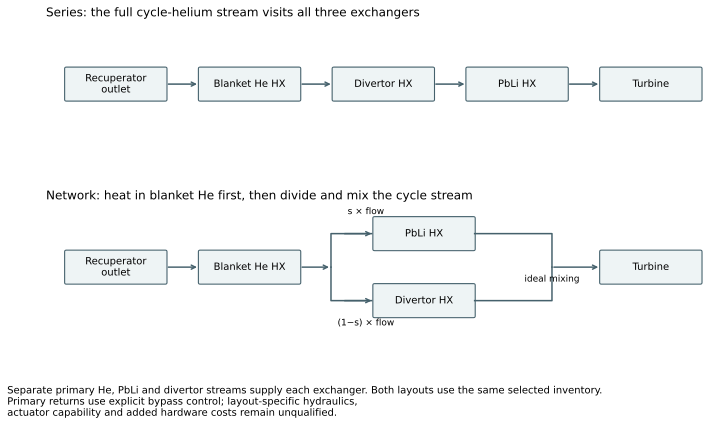
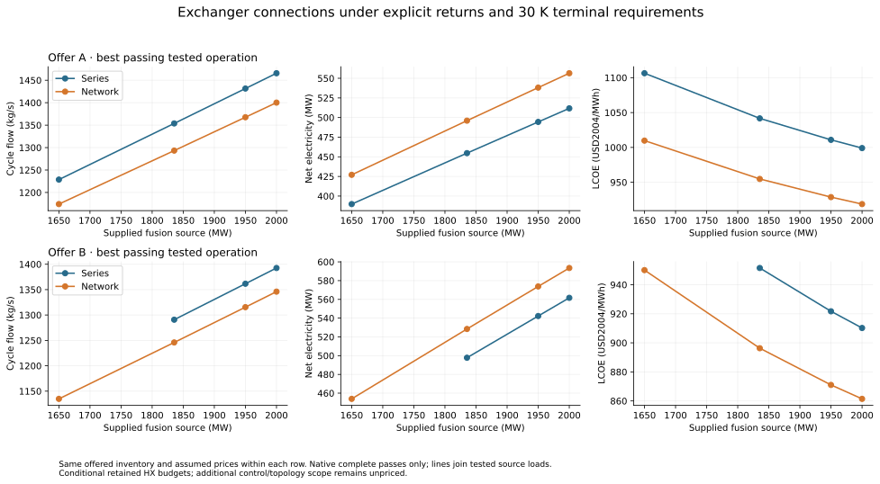
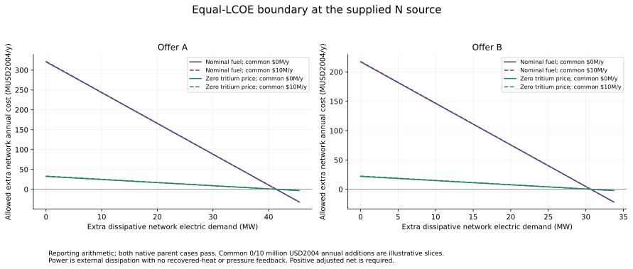

# Exchanger architecture: verified thermal comparison

**The network retains a real conditional advantage after thermal correction and fine refinement.** At 1,835.451 MW supplied fusion, offer B produces **528.43 MW net in the network versus 497.77 MW in series**, a **30.66 MW gain**. Both operating points meet the specified primary returns, all six 30 K terminal minima, full heat removal and equipment checks. This gain is much larger than the remaining sampled refinement changes. [Verified results](evidence/r3-results-analysis.md).

**Study complete:** independent thermal/economic review passes, the native record is sealed, and a fresh 1,277-case replay reproduces every stored output and verdict exactly. Formal goal and work-item closure remain owner-held. No further thermal or study-choice input is needed from the owner.

## What is compared

Series sends cycle helium through blanket-He, divertor and PbLi exchangers in sequence. The network passes blanket-He first, then splits between PbLi and divertor before mixing. Both receive identical source conditions, purchased hardware, primary return control, fuel and finance. Cycle flow is an operating choice for both; the network also chooses its PbLi split.

The source is supplied, with the N heat partition, fixed primary flows and 20 MW deposited auxiliary heating charged as 40 MW electric. This establishes a downstream comparison; it does not demonstrate plasma sustainment at each supplied load. The detailed [study contract](evidence/r3-study-contract.md) and [cost boundary](evidence/r3-cost-boundary.md) retain every choice and omission.

## Thermal requirements and equipment

The source's cited **30 K applies to the ends of its composite exchanger-bank temperature diagram**. It does not uniquely prescribe all six individual primary-exchanger terminals. Under delegated judgment, this comparison adopts **30 K at both actual terminals of each primary exchanger**, excluding the recuperator. This is an explicit agent-selected requirement. Aggregate primary returns are **386 °C blanket helium, 451 °C PbLi and 573 °C divertor helium**; inherited hot caps are 456, 738 and 700 °C. Primary hot bypass maintains those aggregate returns. The cold approach uses the actual exchanger outlet before bypass mixing. [Source reading and requirement provenance](evidence/r2-thermal-requirements.md).

Two necessary negatives change the earlier result:

- The divertor return, flow and hot cap allow at most **329.7555 MW** of delivered heat, corresponding to **2,005.037 MW supplied fusion** under the main convention. The former 2,200/2,300 MW leaders require 359/374 MW and fail regardless of architecture or area.
- The original divertor exchanger has UA = 50 MW/K. With both terminal gaps at least 30 K, the counterflow relation requires at least **1,500 MW** through it. That contradicts the 329.7555 MW cap. Primary bypass cannot cure this while all installed area remains active.

The revised exchangers are explicit fixed selections:

| Inventory | He / PbLi / divertor area, m² | UA, MW/K | Assumed total purchase, million USD2004 |
|---|---:|---:|---:|
| Original, fails main contract | 50,000 / 50,000 / 50,000 | 50 / 50 / 50 | 174.9771 |
| A | 12,000 / 12,000 / 2,000 | 12 / 12 / 2 | 174.9771 |
| B | 18,000 / 18,000 / 2,000 | 18 / 18 / 2 | 174.9771 |

Each revised exchanger books **58.3257 million USD2004**, a retained budget assumption, not a vendor quote. The old area-price extrapolation flags remain visible. Machinery ratings stay fixed. U is held at 1,000 W/m²/K despite changing active primary flow; that is a model assumption. No exchanger is resized from demand. [Price selection and propagation](evidence/r3-cost-boundary.md).

## Passing operating points

| Supplied fusion, MW | Offer | Series net, MW | Network net, MW | Network gain, MW |
|---:|:---:|---:|---:|---:|
| 1,650 | A | 389.78 | 427.08 | 37.30 |
| 1,650 | B | No sampled pass | 453.92 | Undefined |
| 1,835.451 | A | 454.68 | 496.05 | 41.37 |
| 1,835.451 | B | 497.77 | 528.43 | 30.66 |
| 1,950 | A | 494.44 | 538.15 | 43.72 |
| 1,950 | B | 542.26 | 573.81 | 31.55 |
| 2,000 | A | 511.71 | 556.45 | 44.74 |
| 2,000 | B | 561.66 | 593.46 | 31.80 |

These are best passing tested operations, not global optima. At 2,000 MW the divertor hot-cap margin is only **0.291 K**. The nominal 1,835.451 MW pair is the main explanatory comparison and the load used for operating sensitivities. A missing passing series sample at 1,650 MW with B is not proof that no such operation exists.

The search made 91,234 independent evaluations. Final native passing points have failed lower-flow neighbors only **0.00625 kg/s** away. Split refinement reaches 0.0005, with an additional 0.00025 stage where needed to meet the **0.2 MW / 0.1 USD2004/MWh** stability targets. No sampled passing outer edge remains. [Refinement evidence](evidence/r3-data/refinement.csv) and the native record's [additional refinement receipt](../../../../exploration/exchanger_architecture/thermal_requirements/studies/20260927-exchanger-thermal-comparison-b/oracle-refinement-receipt.json) distinguish independent scouting from executed native points.

### The nominal pair actually meets its thermal contract

Offer B series uses **1,290.7834 kg/s** cycle helium. The network uses **1,245.9348 kg/s**, with **0.741** sent to PbLi. Their actual terminal gaps are:

| Primary exchanger | Series hot / cold gap, K | Network hot / cold gap, K | Aggregate return, °C, both |
|---|---:|---:|---:|
| Blanket He | 70.161 / 33.833 | 52.564 / 47.150 | 386 |
| PbLi | 85.429 / 36.815 | 51.492 / 64.498 | 451 |
| Divertor He | 276.022 / 72.408 | 122.225 / 186.621 | 573 |

Both remove all **2,240.389 MW** delivered heat. Their shared hot-cap margins are **17.058 / 83.307 / 9.797 K**. The blanket-He bypass fractions are substantial: **68.87% series and 63.23% network**. Series also bypasses **52.93%** of divertor flow; the network divertor bypass is nearly zero. These are solved thermal controls, not qualified valve capacities or priced control packages.

Across all 15 selected main operating points, the smallest actual terminal gap is **33.833 K**, maximum aggregate return error is about **1.14 × 10⁻¹³ K**, and all 35 native predicates pass. Complete actual hot states, exchanger outlets, mixed returns, bypass fractions and case IDs are in [thermal states](evidence/r3-data/thermal.csv).

The mechanism remains access to **lower passing cycle flow**. Splitting keeps the divertor from preheating the whole PbLi inlet stream. Lower cycle flow reduces compressor work while the coupled cycle recalculates. Seven passing equal-flow controls give exactly equal net electricity between architectures. [Equal-flow controls](evidence/r3-data/equal-flow.csv).

## Economics and break-even allowances

At the nominal offer-B pair, represented direct/overnight capital is identical: **2,919.603 / 4,350.208 million USD2004**. Annualized represented costs are also equal. Finance uses 40 years, 85% availability, 5% real discount and six construction years.

| Cost treatment, USD2004/MWh | Series | Network | Network reduction |
|---|---:|---:|---:|
| Nominal purchased tritium | 951.51 | 896.30 | 55.21 |
| Excluding recurring fuel charges, initial fuel capital retained | 104.29 | 98.24 | 6.05 |
| Zero-tritium-price accounting endpoint | 95.96 | 90.39 | 5.57 |

The nominal tritium price is an assumed 30 million USD2004/kg. The zero-price endpoint reprices initial tritium stock and annual purchases; it makes no breeding claim. Half/double HX prices and the labelled extrapolated linear-area price retain the nominal paired preference. [Executed financial endpoints and parents](evidence/r3-data/financial-parents.csv).

Unknown bypass pipes/valves, manifolds, actuation, maintenance and hydraulic effects remain **incremental beyond the retained piping/control budgets**. Their coverage by those budgets is unresolved. For represented annual cost A, unknown annual addition B, and external dissipative electrical demand p:

`L_i = (A_i + B_i) / [8760 × availability × (P_i − p_i)]`

`B_network,max = (E_network / E_series) × (A_series + B_series) − A_network`

At the nominal B pair's zero-tritium-price endpoint, assuming no extra series cost or power, the network can carry **21.91 million USD2004/year extra annualized cost with no extra power**, or **30.66 MW extra dissipative demand with no extra cost**, before losing its price advantage. Intermediate combinations follow the break-even curve. With no extra power and a common unknown annual cost Bc on both layouts, the differential network allowance becomes **21.91 million + 0.061593 × Bc**. Common costs do not cancel when electricity differs. Under nominal tritium pricing the zero-power allowance is 217.22 million/year, showing why the fuel convention matters.

These are affordability limits, not piping estimates. External power subtraction assumes no recovered heat or pressure feedback. Pump and pressure-loss changes require the native coupled calculation. [Allowances and curve coordinates](evidence/r3-data/break-even.csv).

## What changes the preference

Operating sensitivities cover **offer B at 1,835.451 MW only**, with flow/split reselected:

- U reduced 20% retains a **19.41 MW** network gain. U increased 20% yields a network pass but no sampled series pass; a paired price allowance is undefined.
- Common 2% or 8% cycle pressure loss retains gains of **29.94 / 31.77 MW**. But **8% network loss against 4.5% series loss reverses the preference**: network 491.18 versus series 497.77 MW, and network LCOE is 12.76 USD2004/MWh higher.
- Pump power ±20%, including recalculated recovered heat, retains gains of **30.06 / 31.29 MW**. The alternative post-pump return convention retains **29.32 MW**.
- Requiring 45 K at all six terminals finds no passing sampled operation for either architecture. Limiting each primary bypass to 25% or 50% also finds no passing sampled operation. The positive result depends on the declared return-control freedom.

These sampled responses do not establish robustness outside the tested offer/load or qualify constant-U behavior, exchanger geometry, actuator capacity or procurement. [Sensitivity results and coverage](evidence/r3-data/sensitivity-coverage.csv).

## Evidence and status

All **1,277 native cases completed** and passed independent numerical verification on **435 channels and 35 predicates each**. **535 cases pass every engineering acceptance check; 742 fail at least one.** Every failed case remains visible in the [complete ledger](evidence/r3-data/cases.csv). A repaired floating-point cancellation defect required a new executable; every original input map was retained, the failed attempt was preserved, and the oracle, requirements and tolerances stayed unchanged. [Cross-attempt correlation](../../../../exploration/exchanger_architecture/thermal_requirements/studies/20260927-exchanger-thermal-comparison-b/results/prior-attempt-correlation.json).

The model validator retains known baseline warnings and pure-EXPOSE expression diagnostics; this is not an all-level validator pass. Generated execution, independent physical calculations and integration checks provide the numerical evidence. A plant recommendation remains outside this goal's revised criterion.

- [Native study record](../../../../exploration/exchanger_architecture/thermal_requirements/studies/20260927-exchanger-thermal-comparison-b/record.md)
- [Replay instructions](evidence/r4-replay.md), [exact replay receipt](evidence/r4-delivery-replay.json), [renderer](evidence/r3-render-results.py), [complete reporting data](evidence/r3-data/reporting.json)
- [Proposed article passage](evidence/proposed-passage.md), [final review](evidence/r4-final-review.md), [seal and replay review](evidence/r4-seal-review.md), [goal trail](trail.md)
