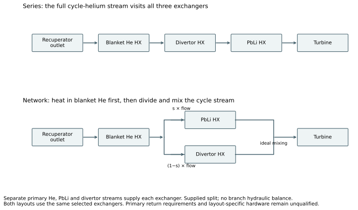
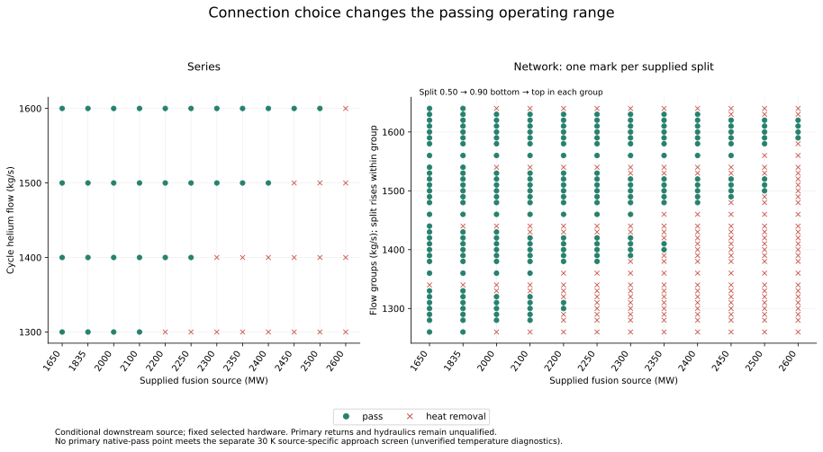
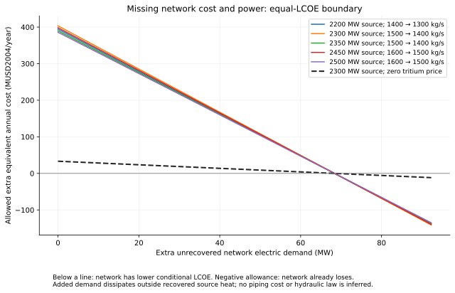

# Exchanger connections, operating range and electricity cost

## Thermal continuation — 2026-09-27

**The earlier leading cases do not satisfy the newly proposed primary-return requirements.** The owner's revised criterion is a thermally consistent conditional architecture comparison; full plant qualification is unnecessary. [Owner direction](evidence/owner-supplement-r2.md).

The original Raffray pages put the cited 30 K at the two ends of a typical exchanger-bank temperature diagram. They do not uniquely prescribe minimum differences at all six individual exchanger terminals. The proposed N-R comparison adopts source-informed aggregate cold-return targets of 386 °C for blanket helium, 451 °C for PbLi and 573 °C for divertor helium. These are explicit conditional design choices, not established requirements of the original N case. Existing delivered duty includes recovered pump heat once. [Source reading and proposed requirements](evidence/r2-thermal-requirements.md).

At the retained divertor flow and 700 °C hot cap, that return target permits 329.7555 MW of delivered heat. The old 2200 and 2300 MW fusion cases require 359 and 374 MW: both architectures fail, independently of exchanger area or cycle flow/split refinement. The corresponding source-side upper load is 2005.036667 MW. The reproducible assessment of all 432 prior main-grid cases finds 324 necessary hot-cap failures; the other 108 have not been established thermally passing. [Assessment code](evidence/r2-return-screen.py) and [complete results](evidence/r2-return-screen.json). No native model or historical study was changed by this assessment.

**Round 3 underway:** the owner delegated the remaining judgment, and the adopted requirement is at least 30 K at both actual terminals of each of the three primary exchangers. It does not apply to the recuperator. WI-097 now implements physical primary bypass, maintained aggregate returns and actual terminal checks in an isolated package; independent implementation review passes. The refined study is running on two explicit area/price offers. No renewed owner input is needed. See [delegated authority](evidence/owner-supplement-r3.md), [implementation review](../../../active/WI-097_exchanger-thermal-requirements/evidence/implementation-review.md) and [study contract](evidence/r3-study-contract.md).

## Round 1 result under the earlier thermal contract

The network expands the operating range under the original implemented checks and sometimes lowers conditional LCOE. Changing the split fixes the prior network shortfall. At several common loads it also permits a lower cycle flow, saving net electricity with the same selected hardware. The following retained results do not include the N-R return requirements or an adopted local approach requirement; they establish neither a preferred N-R operation nor its thermal adequacy.

## Starting design and changed decision

The starting design is the existing ARIES three-primary-stream/helium-Brayton assembly, with three 50,000 m² exchangers, 50 MW/K conductance each, and compressor/turbine/generator ratings of 1,600/3,500/1,800 MW. The assumed original case calculates 1,835.451283 MW fusion and 423.106794 MW net at 1,400 kg/s cycle helium, recuperation 0.8 and 4.5% cycle pressure loss. Its entire 551-output historical result reproduces exactly.

This plasma calculation has no required-heating result. The comparison therefore supplies the fusion load and explicitly retains 20 MW deposited heating, charged as 40 MW electric. It is a **downstream source-conditioned comparison**, with unchanged deposition fractions, primary flows and hot-temperature caps. It does not establish plasma sustainment or a realizable blanket across that load range. The previous 891 MW alternative is a different configuration and is excluded. Exact boundaries and inventory are in the [comparison contract](evidence/comparison-contract.md) and [cost audit](evidence/cost-audit.md).

The physical change is in the cycle-helium connections:

Series sends all cycle helium through blanket-He, divertor and PbLi exchangers in that order. The network first passes blanket-He, then divides between PbLi and divertor and mixes before the turbine. The supplied PbLi split is an operating choice. Both graphs get the same four cycle flows: 1,300, 1,400, 1,500 and 1,600 kg/s. The network tests eight splits between 0.50 and 0.90. Compressor ratios and all purchased hardware remain fixed. No equipment is enlarged from demand.

## What changes in the tested range

The primary grid has 432 cases: **247 pass the implemented checks and 185 fail heat removal**. Equipment checks pass throughout this grid, so no equipment boundary is found inside it. The full study, including controls and uncertainties, has 648 executed and verified cases, with 397 native passes and 251 failures. All failures remain in the [complete candidate ledger](evidence/results-candidate-ledger.csv).

| Supplied fusion load, MW | Best passing series, MW net | Best passing network, MW net | Connection effect on this grid |
|---:|---:|---:|---|
| 1,650 | 341.0 | 341.0 | Equal |
| 1,835.451 | 491.5 | 491.5 | Equal; both use 1,300 kg/s, below the original 1,400 |
| 2,000 | 624.9 | 624.9 | Equal |
| 2,100 | 706.1 | 706.1 | Equal |
| 2,200 | 718.8 | 787.2 | Network gains 68.4 MW |
| 2,250 | 759.4 | 759.4 | Equal |
| 2,300 | 731.6 | 799.9 | Network gains 68.4 MW |
| 2,350 | 772.1 | 840.5 | Network gains 68.4 MW |
| 2,400 | 812.7 | 812.7 | Equal |
| 2,450 | 784.9 | 853.2 | Network gains 68.4 MW |
| 2,500 | 825.4 | 893.8 | Network gains 68.4 MW |
| 2,600 | No passing tested case | 906.5 | Network extends the sampled range |

These are best tested points, not optima or continuous bounds. The discrete flow choices explain the steps and dips. Series has a sampled upper bracket between 2,500 MW passing and 2,600 MW failing; the network upper boundary is not found. There is no paired LCOE comparison at 2,600 MW because series has no passing comparator. Tied network splits are all retained in [the selection data](evidence/results-best-ties.csv).

## Why the network helps

At 2,300 MW supplied fusion, series at 1,400 kg/s leaves 18.968 MW unremoved in PbLi. Passing through the divertor first has already warmed the whole cycle stream. The network gives PbLi and divertor the same inlet after blanket-He, and a suitable split removes all heat at 1,400 kg/s. Series needs the next offered operating flow, 1,500 kg/s. The earlier failure at split 0.85 was a divertor-flow shortage, not a failure of every network split. The branch attribution corrects the prior B3 summary's general helium-stage wording; original evidence is preserved.

The two passing cases accept exactly the same 2,764.4 MW: 1,087.772 MW from blanket-He, 1,302.628 MW from PbLi and 374 MW from divertor. The difference is the cycle operation required to accept it:

| Stored quantity, MW except flow | Series | Network |
|---|---:|---:|
| Cycle flow, kg/s | 1,500 | 1,400 |
| Compressor work | 1,470.912 | 1,372.851 |
| Gross electricity | 964.125 | 1,032.486 |
| Generator loss | 19.676 | 21.071 |
| Primary pump electricity | 166.010 | 166.010 |
| Heating electricity | 40.000 | 40.000 |
| Total auxiliary electricity, including pumps/heating | 232.562 | 232.562 |
| Cycle heat rejection | 1,780.599 | 1,710.843 |
| Net electricity | **731.563** | **799.924** |

Lower compressor work, together with the recalculated turbine/recuperator states, gives the 68.361 MW net gain. At identical cycle settings, if both graphs remove all heat, their modeled electricity is equal. This is a heat-transfer feasibility benefit, not an independent efficiency bonus from splitting. Native case IDs are `c0234` (series) and `c0228` (network); full states, purchases and energy residuals are in [results-cases.csv](evidence/results-cases.csv).

## Economics and omitted network costs

Both layouts buy the same represented inventory: 2,919.603 million USD2004 direct and 4,350.208 million overnight. Finance is identical: 40 operating years, 85% availability, 5% real discount and six construction years. Native replacement events, nonfuel expenses, initial fuel stock and terminal/salvage terms are included once. Topology-specific manifolds, valves, controls, installation and hydraulic losses are incomplete, so equal represented cost does not establish equal physical cost.

At the 2,300 MW pair, all annualized cost numerators are equal. The connection effect on LCOE comes entirely from more electricity:

| USD2004/MWh | Series | Network |
|---|---:|---:|
| Capital contribution | 53.878 | 49.273 |
| O&M | 12.851 | 11.752 |
| Tritium | 721.560 | 659.896 |
| Deuterium | 0.016 | 0.015 |
| Dated replacements | 1.909 | 1.746 |
| Other terms, net | 2.324 | 2.125 |
| **Total, nominal tritium purchase assumption** | **792.538** | **724.808** |
| **Total, zero-tritium-price bookkeeping endpoint** | **65.297** | **59.717** |

The nominal assumption is 30 million USD2004/kg tritium with no new breeding credit; it is not an established supply scenario. Zero price is an agent-selected sensitivity, also repricing initial stock, not a breeding claim. The paired benefit persists at **5.580 USD2004/MWh** under that endpoint, versus **67.730** under nominal purchase. Across different source loads, fuel demand also changes; those changes are not connection effects. [Paired cost figures and data](evidence/figures/paired-performance-cost.svg) separate these effects.

At 2,300 MW, the zero-price endpoint permits **33.237 million USD2004/year of extra equivalent annual network cost with no extra power demand**, or **68.361 MW extra unrecovered electric demand with no extra cost**, before the two prices become equal. The nominal fuel assumption raises the cost allowance to 403.414 million/year. Intermediate combinations lie on the plotted line. These are budgets for missing costs, not estimates of them. Additional demand is assumed dissipated outside recovered source heat; actual pressure-loss and recovered-pump effects require the native coupled calculation. An equal-output pair has no positive extra-cost/power allowance.

## Does the explanation survive uncertainty?

- **Conductance:** U ±20% at fixed area retains the 68.361 MW best-tested gain at 2,200 and 2,300 MW. This is a performance uncertainty, not a priced hardware improvement.
- **Common pressure loss:** at 2,300 MW, reducing both layouts to 2% loss lets series pass at the lower flow too, eliminating the advantage. At 2,200 MW, 8% common loss also removes it.
- **Topology-specific pressure loss:** comparing network at 8% against series at 4.5%, and reselecting among the existing tested network settings, changes the 2,200 MW comparison to 695.501 versus 718.810 MW: series leads by 23.309 MW. At 2,300 MW the network still leads, 775.792 versus 731.563 MW. Fixed preselected network splits fail in both extra-loss controls; their failures remain visible. This is an assumed differential, not a hydraulic prediction.
- **Pumping:** native fixed-power sensitivities at ±20% include recovered friction heat. The lower-power case removes the advantage at 2,300 MW; the higher-power case removes it at 2,200 MW.
- **Temperature approach:** all 247 primary native-pass cases fail the separate source-specific 30 K screen. The two highlighted passing cases have minimum terminal differences of about 0.00026 K and 1.720 K. These are native diagnostic outputs outside the independent oracle catalog. No required primary-return conditions are implemented.

The split mechanism is demonstrated. The resulting preference is conditional on the missing thermal and hydraulic requirements. [Sensitivity data](evidence/results-sensitivities.csv) retain the individual cases and statuses.

## Completion, review and replay

**Partial completion.** The fixed-inventory operating/economic comparison is executed, numerically verified and explained. The requested figures, candidate ledger, source data, renderer and replay instructions are delivered. A physically qualified architecture recommendation remains unmet: required primary returns, suitable minimum approaches, achievable split/pressure losses and architecture-specific equipment costs need support. No additional inventory is silently introduced to clear those gaps. A further hardware study first needs explicit thermal requirements and offered equipment; extra rounds of this unchanged model would not establish them.

Independent pre-execution review covered the source fallback, interfaces, accounting, MR-7 and sensitivity authority. Final integration/answer review and the study seal are recorded in the [trail](trail.md). Every retained case was verified against the package-owned oracle on 364 scalar channels and all 14 predicates; the full 551 native outputs are preserved. The original package is unchanged. Formal goal closure remains owner-held.

- [Native study record](../../../../exploration/exchanger_architecture/studies/20260926-design-study-exchanger-architecture/record.md)
- [Exact replay instructions](evidence/replay.md)
- [Detailed reading](evidence/results-reading.md), [figure renderer](evidence/render-results.py), [changed/reused inventory](evidence/changed-reused.md)
- [Proposed article passage](evidence/proposed-passage.md); the owner's article was not edited.
