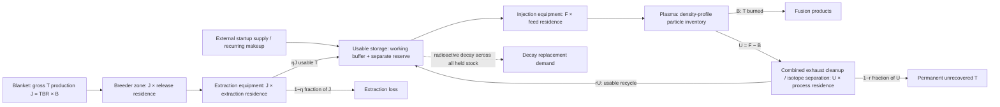

# Fuel-flow and storage boundary

## Existing implementation

At entry `e36fe456805655fe404d49a5fd4d83f9f8c814a4`, `models/library/analyses/mfe_fuel_cycle.sysml` calculates tritium atom flows: burn B=P/Q, injection F=B/f, exhaust U=F−B, permanent recycle loss L=(1−r)U, and required gross breeding (B+L+λI+G)/(ηB). The formula is preserved. `models/library/structure/mfe_plant_systems.sysml:385` owns the Fuel Cycle, supplies flows and passes stock to the formula. `models/designs/generic_mfe/mfe_plant.sysml:101` binds fusion power, breeding and calendar availability. `models/designs/stellarator_09/stellarator_plant.sysml:1352` supplies f=0.05, r=0.99, η=1, λ=ln(2)/(4500 days), I=0 and G=0. The numerical recovery is inherited from a feedstock-cost factor and is explicitly conditional isotope recovery, not a measurement. This goal preserves that meaning. Feedstock cost remains its separate existing account.

`models/library/analyses/mfe_tritium_breeding.sysml` and stellarator `breeding_adequacy` consume the same inventory, decay and recovery quantities; the blanket owns achieved gross TBR. Computing I activates an existing decay term without changing required-breeding arithmetic. Generic Fuel Cycle currently has dormant safe defaults; the stellarator activates the new inventory model. Both canonical and exploration twins, generated contracts/implementation, oracle, snapshot, census and manifest require coordinated integration.

Vacuum uses equal D and T exhaust atom rates plus helium ash at the reaction rate. Fuel-processing capacity is isotope-specific; total hydrogen-isotope mass uses both D and T masses. Helium, impurities, carrier gas and PbLi mass are distinct from hydrogen-isotope throughput. Existing vacuum gas throughput is a different capacity interface.

## Streams and storage diagram

[AGENT] This is the selected serial accounting boundary, refined from the preliminary sketch after source research. The source provides one combined processing residence, not independently supported cleanup/separation times. All U resides before recovery loss is removed at the processor outlet. Temporary hold-up is inventory; permanent loss is never also treated as held stock. Wall retention, permeation, detritiation, bypass and carrier streams remain unsupported. Reserve and working buffer are separate usable storage stocks. At startup the feed equipment, plasma and usable stock floor are prefilled; exhaust and breeding stages start empty.

## Equations and source register

The authoritative proposed implementation equations, startup horizon, conservative decay bound, units, source/assumption table and consumer contract are in [WI-069 design](../../../../active/WI-069_fuel-inventory-and-startup/design.md). Source evidence is [the native pending research report](../../../../../knowledge/research/pending/20260919-074901_fuel-inventory-residence-startup.md). Preliminary conditional math review is `math-precheck.md`; final source/design release is a separate review of the revised topology and prefilled plasma condition. The report distinguishes source compartment kinetics from the chosen deterministic-delay approximation.
